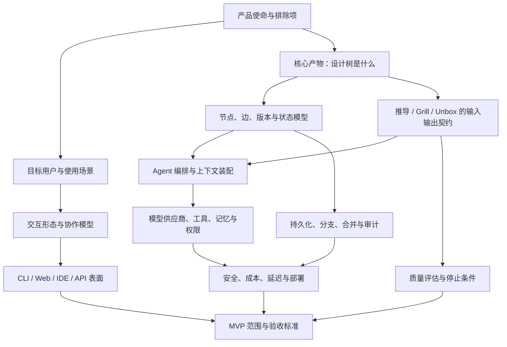
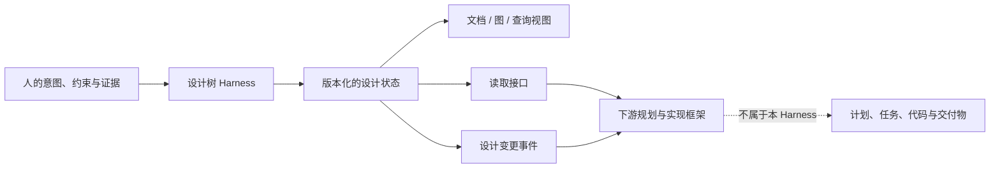
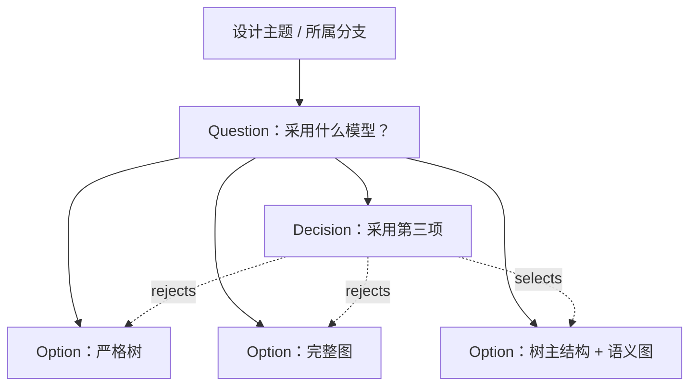

# TreeDiagram Agent Harness — 设计规格（持续更新）

> 状态：探索中 — 第 6 轮提问中（B3 收束前）  
> 最近更新：2026-08-07  
> 用途：记录已确认决策、暂定假设、待决问题、决策依赖与讨论历史。本文档是后续实现的唯一主设计源；讨论中出现的新设计与问题会持续归档到这里。

## 1. 当前产品意图

构建一个专用于**项目设计、产品设计与游戏设计**的 agent harness。核心不是一次性生成方案，而是围绕一棵可追踪的“设计树”组织长期推演，并支持至少三类工作流：

- **推导（derive）**：从目标、约束、证据与既有决策向下展开候选设计。
- **Grill**：对方案、假设和决策进行系统性追问、反证与压力测试。
- **Unbox**：识别过早收敛和隐含框架，松动默认前提，重新打开解空间。

以上表述目前只是用户提出的方向，尚未构成已确认的产品定义。

## 2. 记录约定

### 2.1 决策状态

- `已确认`：双方明确同意，后续分支可依赖。
- `暂定`：为了继续探索而采用，后续允许推翻。
- `待决`：需要明确选择。
- `开放`：已发现但尚未进入当前讨论路径。
- `废弃`：曾被考虑，现已明确不采用；保留原因以防重复讨论。

### 2.2 设计树节点的临时分类

在数据模型尚未确认前，先用以下语义标签记录讨论：

- `G` Goal：目标或成功标准
- `C` Constraint：约束或边界
- `A` Assumption：假设
- `Q` Question：待回答问题
- `O` Option：候选方案
- `D` Decision：已作决策
- `E` Evidence：证据或来源
- `R` Risk：风险或反例
- `X` Experiment：验证动作
- `F` Finding：推演或实验得到的发现

这只是文档层的临时本体，不代表最终产品必须采用这些节点类型。

## 3. 顶层决策依赖

关键原则：先确认上游语义，再固化下游技术。尤其不能在“设计树究竟表达什么”之前决定数据库 schema，也不能在工作流契约之前决定多 agent 拓扑。

## 4. 探索分支清单

| 编号 | 分支                         | 状态      | 主要上游依赖 |
| ---- | ---------------------------- | --------- | ------------ |
| B1   | 产品使命、边界与非目标       | 已确认    | 无           |
| B2   | 目标用户、任务与使用场景     | 已确认    | B1           |
| B3   | 设计树语义与数据模型         | V1 已确认 | B1、B2       |
| B4   | 推导工作流                   | V1 已确认 | B3           |
| B5   | Grill 工作流                 | V1 已确认 | B3、B4       |
| B6   | Unbox 工作流                 | V1 已确认 | B3、B4、B5   |
| B7   | Agent 角色、编排与控制权     | V1 已确认 | B3–B6        |
| B8   | 上下文、记忆、证据与溯源     | V1 已确认 | B3、B7       |
| B9   | 人机交互与协作               | V1 已确认 | B2、B3、B7   |
| B10  | 版本、分支、合并与生命周期   | V1 已确认 | B3、B9       |
| B11  | 模型、工具、插件与供应商抽象 | V1 已确认 | B7、B8       |
| B12  | 质量评估、停止条件与可观测性 | V1 已确认 | B4–B8        |
| B13  | 权限、安全、隐私与治理       | V1 已确认 | B8、B11      |
| B14  | 部署、成本、性能与离线能力   | V1 已确认 | B9、B11、B13 |
| B15  | MVP、路线图与验收            | V1 已确认 | 全部关键分支 |

## 5. 当前已知与暂定假设

### 5.1 已知输入

- `已确认` 当前仓库为空项目。
- `已确认` 产品服务于项目、产品、游戏设计，而非单一垂直领域。
- `已确认` 设计树推演是核心组织方式。
- `已确认` 计划包含推导、Grill、Unbox 等工作流。
- `已确认` 需求澄清采用逐分支深入方式，每轮提出 3–5 个问题，并解释来龙去脉与依赖。

### 5.2 暂定工作方式

- `暂定` 每轮聚焦一个主分支；只有当跨分支依赖会造成歧义时才穿插追问。
- `暂定` 回答会区分“事实 / 偏好 / 假设 / 决策”，避免把讨论中的例子误固化为需求。
- `暂定` 尚未确认的答案不会进入实现计划，只进入待决项。

### 5.3 已确认决策登记

#### D-001 — 核心产物是可持续演化、机器可执行的设计状态

- `已确认` 主目标不是生成一次性的设计文档，而是维护一份长期演化的结构化设计状态。
- `已确认` 次目标是提升人的思考与决策质量。
- 直接含义：文档只能是设计状态的一种视图或导出格式，不能成为唯一真相源。
- 待澄清：“机器可执行”在第一代具体意味着可运行工作流、可计算状态转换、可验证约束，还是三者的组合。

#### D-002 — 第一代只负责设计，不进入实现

- `已确认` 第一代在设计边界停止，不负责规划、实现设计、实现计划或具体实现。
- `已确认` 后续会有其他框架承接这些阶段；本 harness 需要提供读取设计的接口，以及设计变动通知能力。
- 直接含义：第一代的末端产物必须有清晰的交接契约，但无需内置任务执行器或代码 agent。

#### D-003 — 领域无关内核优先

- `已确认` 设计树工作流应服务各种项目和产品，不为项目设计、产品设计或游戏设计分别建立硬编码内核。
- 直接含义：核心本体应描述跨领域稳定存在的设计语义；领域知识更适合作为可选模板、规则、方法包或扩展。

#### D-004 — 首要不可替代能力

按优先顺序暂记为：

1. `已确认` 显式、可查询的设计决策树；
2. `已确认` 系统性追问与遗漏检测；
3. `已确认` 证据、假设、决策之间的溯源。

直接含义：推导、Grill、Unbox 是操作这份状态的工作流，而不是产品唯一价值本身；每次工作流运行都应留下可查询的状态变化与推理来源。

#### D-005 — 人类确认 + 分支级 AI 托管

- `已确认` 默认情况下，Agent 可以展开分支并作“暂定决策”，人负责最终确认。
- `已确认` 用户可以声明某个分支的细节完全交由 AI 托管。
- 直接含义：自治权限不是全局布尔值，而是设计树上的作用域策略，并可能向后代节点继承。
- 待澄清：托管范围的继承、撤销、风险限制，以及 AI 在托管分支内能否作不可逆的最终确认。

#### D-006 — 通过接口与事件连接下游框架

- `已确认` 规划、实现设计、实现计划与具体实现属于其他框架。
- `已确认` 本 harness 最多承担设计读取接口和设计变动通知，不侵入下游阶段。
- 直接含义：需要稳定的设计快照/查询契约和变更事件；具体协议、事件粒度与兼容策略尚待后续确定。

#### D-007 — 第一代服务独立创作者

- `已确认` 首要操作者是独立创作者。
- `已确认` 产品判断基于一个长期趋势假设：AI 提升个体产能后，更多行业会转向独立创作者主导。
- 直接含义：默认交互不能假设有产品经理、研究员、架构师等多人分工；Agent 需要帮助一个人补足结构化思考、反方审查和信息整理能力。
- `假设` 独立创作者内部仍有明显的专业程度差异；默认引导强度与可配置性后续确认。

#### D-008 — 任意初始材料先归一化为根部与设计假设

- `已确认` 系统可以从模糊想法、零散资料或既有设计等不同成熟度的状态开始。
- `已确认` Agent 首先帮助用户提炼项目的“第一性原理 / 设计不动点”，确认设计树根部。
- `已确认` 其余输入在未经验证和确认前按设计假设导入，不能因为来自既有文档就自动成为事实或决策。
- 直接含义：初始化不是简单导入，而是一个带来源保留、语义分类和根部确认的归一化工作流。

#### D-009 — 设计不动点可修订，但修订会触发全树重新评估

- `已确认` “不动点”表示推导时作为稳定依据，而非物理上不可编辑。
- `已确认` 用户可以主动编辑根部。
- `已确认` Agent 发现根部存在明显矛盾时，可以请求用户批准修改根部。
- `已确认` 根部修改后，所有既有分支都必须重新评估。
- 直接含义：根部必须版本化；节点需要记录自己依赖的根部版本或具体根部命题；根部变更后不能默默保留旧结论。
- 待澄清：“所有分支重新评估”是全部重新运行，还是先全部标记待复核、再按精确依赖增量求值。

#### D-010 — 产品是长期设计工程系统

- `已确认` 一棵设计树伴随项目全生命周期，而非一次性会话。
- `已确认` 一次集中使用通常持续约 20 分钟至 2 小时，受 Agent 等待时间和项目复杂度影响。
- 直接含义：需要可靠的会话恢复、状态摘要、长期版本历史与增量处理；聊天记录本身不能承担项目记忆。
- 待澄清：无人值守运行、任务暂停/恢复和异步通知放到编排与交互分支讨论。

#### D-011 — 第一代为单用户系统

- `已确认` 第一代不实现多人协作。
- 直接含义：无需首版处理多人并发编辑、投票或组织审批。
- `暂定` 即使单用户，所有变更仍应记录主体（用户、具体 Agent 或系统），因为溯源和自治审计依赖作者身份。

#### D-012 — 首版贯穿案例为 AI Agent 程序化建模工具集

- `已确认` 使用“一套给 AI Agent 使用的程序化建模工具集”作为真实贯穿案例。
- 该案例将同时承担 dogfooding：本 harness 用设计树设计另一个供 Agent 使用的工具集。
- 待补全：该工具集的设计不动点、目标 Agent、建模对象和主要约束，将随设计树语义稳定后建立为验收夹具。

#### D-013 — 根部是一组无强制形式的陈述

- `已确认` 设计不动点由一组陈述组成，而不是单段文本或固定 schema 的表单。
- `已确认` 根命题可以模糊，也可以清晰；第一版底层不对其内容形式施加强制约束。
- `已确认` 未来可以按具体项目领域添加根命题形式与校验规则，但不进入第一版。
- 直接含义：第一版的一致性检查主要依靠语义分析、显式关系和人工确认，不能假设根命题具有可机械验证的固定字段。
- `暂定` 每条根命题仍应拥有独立身份与版本，以便只修改其中一条时执行准确溯源；此点将在节点版本模型中确认。

#### D-014 — 树形主结构 + 语义图关系

- `已确认` 用户以树作为主要组织与浏览结构。
- `已确认` 底层允许跨分支语义关系，从而表达严格树无法表达的多对多依赖、支持和矛盾。
- 直接含义：每个节点可有一个主要结构父节点，同时拥有零到多个跨分支类型化关系；“树”是主视图和归属结构，“图”是完整语义。

#### D-015 — 节点本体采用混合模式

- `已确认` 内核提供少数具有稳定语义和规则的节点类型，同时允许更灵活的标签、子类型或扩展形式。
- 待决：内核节点类型的最小集合、哪些概念应作为子类型/标签、以及哪些关系必须成为第一类对象。

#### D-016 — 生命周期按节点类型约束，并包含 AI 托管确认

- `已确认` 不同节点类型可以拥有不同的合法生命周期状态和转换。
- `已确认` “AI 托管确认”作为节点状态存在，而不只是一项显示标签。
- `暂定` 即使它是状态，也仍需分别记录确认 Agent、授权作用域和依据，满足审计与撤销要求。

#### D-017 — 重新评估期间暂停下游消费

- `已确认` 根部变化导致设计进入重新评估时，下游框架暂停消费，直到新设计重新达到一致状态。
- 直接含义：设计状态需要项目级一致性闸门；读取接口必须能明确拒绝或阻止不一致版本，而不是把风险转嫁给每个下游消费者。
- 待决：一致性的精确定义、旧一致快照是否仍可用于只读审计、以及系统如何表示重评进度。

#### D-018 — 节点原子性采用软约束

- `已确认` 原则上一个节点只表达一个可独立确认、反驳或替代的语义单位。
- `已确认` 存储层不硬性拒绝复合表达；Agent 负责识别复合内容并建议拆分。
- 直接含义：系统允许模糊，但应主动减少会导致失效范围不清的复合节点。

#### D-019 — 节点类型的阶段性结论

- `已确认` `Goal` 和 `Constraint` 倾向作为内核独立类型，最终集合仍待本轮补全。
- `已确认` 同一个节点允许多个角色；原子性约束不禁止多角色，因为角色描述的是同一语义单位如何参与不同工作流。
- `已确认` `Risk` 作为内核独立类型。
- `已确认` `Assumption` 不是节点类型，而是一种节点状态；其与确认状态、生命周期的关系仍待明确。
- `已确认` `Validation` 第一版只负责设计验证方法，不执行验证；验证结果由外部/上层框架产生，本 harness 暂不负责主动接收结果。后续可通过普通输入或接口扩展重新导入结果。

#### D-020 — 重要决策显式、局部决策可简化

- `已确认` 重要决策采用显式的“问题—选项—决策”结构；局部小决定允许简化。
- `已确认` 这不是树之外的第二套记录系统：`Question`、`Option`、`Decision` 都是树中的普通节点，完整关系由语义关系实体表达。
- `暂定` 简化决定可只创建一个 `Decision` 节点，把问题摘要、选择和理由保存在该节点内容中；升级为重要决定时再无损展开为显式节点。
- 待决：重要性的判定者、默认树形归属方式和简化决策的最低字段。

#### D-021 — 语义关系采用完整关系实体

- `已确认` 跨节点语义关系不是简单边，而是具有独立身份、类型、端点、创建者、理由、状态和版本的完整关系实体。
- 直接含义：Grill 可以质疑的不只是节点内容，也包括“为什么 A 支持/约束/派生出 B”这类推理连接。

#### D-022 — 已确认内容采用不可静默覆盖的修订模型

- `已确认` 用户界面允许像普通编辑一样修改已确认节点，但后台不覆盖旧内容，而是产生新修订。
- `已确认` 系统提示用户是否根据新修订重新推演后续节点。
- 设计理由：若直接覆盖，证据—假设—决策溯源会被改写，旧决策在当时为何合理将无法解释；下游也无法判断自己读取的是哪一版设计。
- `暂定` 修订不是第二棵用户可见的树：树显示每个逻辑节点的当前工作修订，历史只在检查该节点或审计变化时展开。
- 待决：编辑保存、修订激活、暂停下游和重新推演之间的事务边界。

#### D-023 — 保留通用 Claim 节点

- `已确认` 内核提供 `Claim`，用于表达不属于 Goal、Constraint 或 Risk 的普通事实判断、设计原理、发现和推导结论。
- `已确认` 节点可以附加多个角色；第一版角色集合由 V1 规格收敛，并允许自定义角色。

#### D-024 — Assumption 是独立认知状态轴

- `已确认` 节点的认知状态与治理生命周期分开保存，避免状态组合爆炸。
- `已确认` 从 Assumed 升级为 Supported 必须存在 Evidence。
- `已确认` 思辨、思维实验和 Agent 推演产生的结构化论据也属于 Evidence；它们必须标明方法、前提和局限，不能伪装成外部观测事实。

#### D-025 — 重要决策的升级与完备性规则

- `已确认` Agent 根据是否触及根部/约束、跨分支影响、替代方案数量、失败代价、证据强度和下游依赖主动建议把小决定升级为显式决策单元。
- `已确认` 用户可以调整重要性；AI 托管分支内由 Agent 决定。
- `已确认` 重要决策允许记录“未发现其他可行选项”，无需为了形式完备虚构替代方案。

#### D-026 — 修订采用两阶段激活

- `已确认` 编辑已确认节点先生成候选修订，旧修订继续属于当前一致设计。
- `已确认` 用户选择“采用并重新推演”后，新修订才激活，项目进入重新评估并暂停下游消费。
- `已确认` 候选修订可以长期存在，不要求离开会话前采用或放弃。

#### D-027 — 关系端点锁定具体修订

- `已确认` 用户界面操作逻辑节点，底层关系端点锁定创建关系时的具体节点修订。
- `已确认` 结构父子关系和语义关系都采用修订锁定；否则移动、改写父节点后会静默改变子节点语境。
- `已确认` 新修订激活后，系统可以建议迁移关系，但不得静默迁移已确认关系。

#### D-028 — V1 采用单进程、单 Agent、单工作区复杂度边界

- `已确认` V1 以本地单用户系统实现，一个进程一次打开一个工作区，一个工作区承载一个项目。
- `已确认` Derive、Grill、Unbox 是同一协调 Agent 的工作流模式，不建立多 Agent 群。
- `已确认` 模型只产生结构化 ChangeSet 提案，确定性控制器负责权限、状态转换、一致性和发布。
- `已确认` 采用 SQLite、单一开放 ChangeSet、Release manifest 和可轮询持久事件；不引入分布式队列、完整事件溯源、向量库或消息总线。
- 完整 V1 基线见 [V1_SPEC.md](./V1_SPEC.md)。

### 5.4 当前产品边界

## 6. 第 1 轮：产品使命与边界（B1）

这一轮要先确定系统优化的对象。它将直接限制目标用户（B2）、设计树本体（B3）、工作流停止条件（B12）和 MVP（B15）。

### Q1.1 — 系统最终对什么结果负责？

候选理解包括：

1. 产出一份高质量、可交付的设计规格；
2. 提升人的思考质量，产物只是过程记录；
3. 形成可持续演化、可被 agent 执行的“设计状态”；
4. 从模糊意图一路推进到实现任务，甚至自动进入实现。

需要明确主目标和次目标。不同选择会改变树的叶节点：它可能止于“已解释的决策”，也可能必须落到“可验证任务/代码变更”。

### Q1.2 — “项目 / 产品 / 游戏设计”共享什么核心，差异如何处理？

待判断是：先做一个领域无关内核，再通过模板/领域包扩展；还是选择一个领域作为首个楔子，验证后再抽象。三类设计都包含目标、约束、方案与权衡，但游戏设计还常涉及机制—动态—体验，产品设计涉及用户与指标，项目设计涉及范围、资源和排期。过早统一可能得到空泛模型，分别硬编码又会破坏通用性。

### Q1.3 — Harness 与普通 AI 对话/文档工具的不可替代差异是什么？

需要选出最重要的 1–3 个能力，例如：显式决策图谱、可复现工作流、主动追问、反方压力测试、多分支并行探索、证据溯源、长期状态、从设计到执行的闭环。该答案决定产品护城河，也决定 MVP 不能省略什么。

### Q1.4 — 人与 agent 的最终决策权如何划分？

可能从“agent 只提问和建议，所有决策由人确认”，到“人设定政策后 agent 可自主展开和暂定决策”，再到“特定低风险分支可自动关闭”。这会影响节点状态机、审批机制、自动运行范围和安全模型。

### Q1.5 — 明确不做什么？

请列出首版或长期都不想成为的东西，例如：通用聊天机器人、项目管理器、代码 agent、知识库、多人白板、自动研究工具、需求管理系统。非目标能防止“agent harness”无限扩张，也帮助区分需要原生实现与只需集成的能力。

## 7. 讨论日志

### 2026-08-07 / 初始化

- 确认仓库为空，无既有架构或兼容性约束。
- 建立顶层设计分支、依赖图和第 1 轮问题。
- 尚未作出产品语义或技术选型决定。

### 2026-08-07 / 第 1 轮结论

- 确认设计状态而非一次性设计文档是核心产物。
- 确认第一代止于设计，以读取接口和变更通知衔接其他框架。
- 确认领域无关内核优先。
- 确认三项首要能力：显式决策树、系统性追问/遗漏检测、证据—假设—决策溯源。
- 确认默认由人最终批准，同时支持分支级 AI 托管。

### 2026-08-07 / 第 2 轮结论

- 确认第一代面向独立创作者，按单用户长期设计工程系统设计。
- 确认支持不同成熟度的初始输入，但必须先提炼并由用户确认设计不动点；其他内容默认作为设计假设导入。
- 确认设计不动点是推导期间的根部依据，但允许用户编辑，也允许 Agent 在发现明显矛盾时请求用户批准修改。
- 确认根部变更必须使全树进入重新评估流程。
- 确认单次集中使用约 20 分钟至 2 小时，设计状态伴随项目全生命周期。
- 确认以“供 AI Agent 使用的程序化建模工具集”为贯穿验收案例。

### 2026-08-07 / 第 3 轮结论

- 确认根部是一组可模糊、可清晰的陈述；第一版不施加固定内容形式，领域约束留作未来扩展。
- 确认采用树形主结构与跨分支语义图关系相结合的表达。
- 确认节点本体采用混合模式，但最小内核类型仍需专门推演。
- 确认生命周期按节点类型约束，AI 托管确认是正式节点状态。
- 确认根部变化后的重新评估期间暂停下游消费，直至恢复一致。

### 2026-08-07 / 第 4 轮结论

- 确认节点原子性是由 Agent 协助执行的软约束。
- 确认本体采用混合模式：Goal、Constraint 倾向为强类型，Risk 为强类型，节点允许多角色，Assumption 是状态而非类型。
- 确认本 harness 只设计验证方法，不执行验证或在第一版主动接收外部结果。
- 确认重要决策显式使用问题—选项—决策结构，小决定允许简化；两者都直接记录在树节点和语义关系中。
- 确认语义关系使用完整关系实体。
- 确认已确认节点被编辑时后台创建修订，并询问是否基于新修订重新推演。

### 2026-08-07 / 第 5 轮结论

- 确认使用通用 Claim 内核类型。
- 确认 Assumption 是独立认知状态轴；Supported 必须由 Evidence 支撑，思辨与思维实验也可以成为明确标注的 Evidence。
- 确认重要决策升级规则，并允许记录“未发现其他可行选项”。
- 确认候选修订与活动修订分离，采用后才进入重评；候选可长期存在。
- 确认全部关系端点锁定具体节点修订，迁移必须显式进行。
- 产品意图与核心语义探索到此达成共识；后续由设计者直接收敛低复杂度 V1，不再逐题追问。

### 2026-08-07 / 现场恢复与 V1 收敛

- 发现文档末尾被外部写入一段编码损坏的重复内容；该段没有新增决策。
- 在 `.reasonix/recovery/` 保存损坏版本后，精确移除异常尾部并通过严格 UTF-8 校验。
- 将全部已确认共识收敛到 [V1_SPEC.md](./V1_SPEC.md)，覆盖领域模型、修订与一致性、自治、工作流、交互、接口、运行架构和验收。
- 所有探索分支的 V1 结论已形成；未来问题进入 V2 候选，不反向扩大 V1。

## 8. 第 2 轮：目标用户、任务与使用场景（B2）

这一轮确定谁在什么时刻操作系统。它会约束设计树的默认粒度（B3）、交互模式（B9）、自治策略（B7）和首版验收案例（B15）。

### Q2.1 — 第一代首先服务哪类操作者？

需要区分独立设计者/创始人、产品经理、游戏设计师、技术负责人、跨职能团队或专业咨询者。领域内核可以通用，但首要操作者决定术语、默认工作流、信息密度和学习成本。需要一个明确的第一用户，而不是笼统的“所有做设计的人”。

### Q2.2 — 第一代最重要的触发场景是什么？

候选入口可能是：从一句模糊想法开始新设计；导入已有文档后重建设计状态；对现有设计做评审/Grill；遇到僵局时 Unbox；或持续维护一个已经运行的项目。首要场景决定状态如何初始化，也决定首轮价值出现得有多快。

### Q2.3 — 一次典型使用应以什么节奏发生？

需要判断它更像持续数小时的同步设计会话、跨数周的异步设计工程，还是两者都必须原生支持。长期异步使用要求任务恢复、增量上下文和变更摘要；同步使用则更重视低延迟追问、焦点控制和临时草稿。

### Q2.4 — 第一代是个人工具还是多人协作系统？

如果多人原生参与，就会立即引入身份、意见归属、冲突、审批人、并发编辑和权限；如果先做单人，则仍需决定数据模型是否预留多主体来源，避免未来迁移困难。

### Q2.5 — 用哪个贯穿案例作为首版验收基准？

需要一个规模适中但足以暴露通用性的真实案例。它应包含模糊目标、多个约束、至少两条竞争方案、若干假设/证据、一次 Grill、一次 Unbox、人工确认和一个 AI 托管分支。这个案例将用于验证产品语义，而不仅是做演示。

## 9. 第 3 轮：设计树的根部与核心语义（B3）

这一轮定义系统的核心状态模型。B4–B12 几乎全部依赖它。当前最重要的风险是把“树”过早实现成普通父子目录，随后发现证据、假设和决策存在多对多依赖，无法准确执行影响分析。

### Q3.1 — 设计不动点是单个根节点，还是一组结构化根命题？

一个真实项目的核心通常同时包含存在理由、服务对象、期望变化、不可牺牲原则、硬约束和成功判断。若根部只是自由文本，Agent 很难检查矛盾和执行影响分析；若根部 schema 过重，又会把领域无关内核变成僵硬表单。需要确定最小结构，以及什么测试能判断某条内容有资格成为“不动点”。

### Q3.2 — 用户所见的“树”是否允许底层存在跨分支连接？

同一证据可能支持多个假设，一个约束可能限制多个方案，一个决策也可能依赖不同分支的结论。严格树结构要求每个节点只有一个父节点，容易复制信息并破坏单一来源；完整图结构又可能降低可理解性。可选方向包括严格树、DAG，或“树作为主视图 + 底层语义图”。

### Q3.3 — 第一版需要哪些最小节点类型与关系类型？

当前文档临时使用 Goal、Constraint、Assumption、Question、Option、Decision、Evidence、Risk、Experiment、Finding。需要判断哪些是稳定语义，哪些只是标签或视图。关系也不能只有 parent-child，至少可能涉及 derives-from、depends-on、supports、contradicts、constrains、resolves、supersedes。

### Q3.4 — 节点如何从提出走向确认、失效或被替代？

默认“暂定 → 已确认”还不足以表达待证、被反驳、因上游变化而过期、被新决策取代等状态。需要区分语义类型和生命周期状态，并明确只有用户能执行哪些状态转换、AI 托管分支又能执行哪些转换。

### Q3.5 — 根部变化后的重新评估采用什么语义？

可选机制包括：立即把全树标为待复核；根据依赖图只失效受影响节点；后台自动重跑并生成差异；或组合使用。需要确定在重评完成前，下游读取接口能否继续读取旧的最后一致版本，还是必须看到“设计当前不一致”的状态。

## 10. 第 4 轮：混合节点本体与建模方法（B3 深入）

这一轮先定义 Agent 和用户究竟在创建、连接和确认什么。候选方案刻意把“内容表达自由度”与“设计过程结构”分开：节点正文可以自由，但少数内核语义和关系保持严格。

### 10.1 初始候选内核模型（部分已被第 4 轮答案修订）

#### 共同节点外壳

所有节点暂考虑共享：稳定 ID、内容、内核类型、可选子类型/标签、主要父节点、生命周期状态、创建主体、来源、版本、适用根部版本和扩展数据。

#### 候选内核类型

| 类型                 | 核心含义                                   | 可能通过子类型/标签表达的概念                  |
| -------------------- | ------------------------------------------ | ---------------------------------------------- |
| `Assertion`（命题）  | 系统当前考虑为真、应当成立或值得检查的陈述 | 根命题、目标、原则、约束、假设、发现、风险陈述 |
| `Question`（问题）   | 尚未解决、会阻碍或改变设计的未知项         | 澄清问题、开放问题、阻塞问题                   |
| `Option`（选项）     | 对某个问题或设计空间的候选响应             | 方案、变体、备选路径                           |
| `Decision`（决策）   | 对一个或多个选项作出的采用/排除承诺及理由  | 用户决策、AI 托管决策、条件性决策              |
| `Evidence`（证据）   | 用来支持、削弱或反驳命题的可溯源材料       | 用户陈述、研究来源、观测、指标、外部文档       |
| `Validation`（验证） | 为降低不确定性而定义或执行的检查           | 实验、原型测试、分析、验收检查及结果           |

这里把 Goal、Constraint、Assumption 等收敛为 `Assertion` 的受控角色，避免内核类型爆炸；但如果这些概念具有根本不同的状态机，也可以提升为独立类型。

> 第 4 轮之后的修正：Goal、Constraint 倾向提升为强类型，Risk 确认为强类型，Assumption 改为状态；Validation 仅描述验证方法。完整的新候选集合在第 5 轮确定。

#### 候选内核关系

- 结构关系：`contains / primary-parent`
- 推导关系：`derived-from / depends-on`
- 论证关系：`supports / weakens / contradicts`
- 设计关系：`addresses / constrains / selects / rejects`
- 演化关系：`supersedes / invalidates`
- 过程关系：`produced-by / validates`

### Q4.1 — 节点应当多“原子化”？

影响分析要求节点尽量只承载一个可独立确认或推翻的语义单位；但强迫用户把自然表达拆得过细会造成碎片化。需要决定是否规定“一个节点原则上只表达一个命题、问题、选项或决策”，并由 Agent 建议拆分复合内容，而不是底层强制拒绝。

### Q4.2 — 候选的六种内核类型是否合适？

重点判断 `Assertion` 是否过宽：目标、约束、假设、发现和风险虽然都是陈述，但它们在推导和生命周期上的行为不同。需要决定哪些必须提升为强类型，哪些作为受控子类型就足够，以及 `Validation` 是否应进入设计 harness，还是属于后续规划/实现框架。

### Q4.3 — “问题 → 选项 → 决策”是否应成为内置设计单元？

一种强建模方法是：重要决策必须响应一个显式问题，候选选项链接到该问题，最终决策选择/拒绝选项并记录理由；后果再从决策向下推导。这能显著提升可查询性和 Grill 质量，但会给小决定增加结构成本。需要判断这是强制规则、推荐模式，还是仅由 Agent 自由组织。

### Q4.4 — 语义关系本身是否需要成为可审查的一等记录？

“证据 E 支持假设 A”本身也是一个可能出错的判断。如果关系只是一条无元数据的边，就无法记录是谁建立、理由、置信度、状态或被 Grill 后的异议。若边拥有这些属性，模型更可靠但复杂度明显增加。需要决定第一版是简单类型边，还是带身份、状态、依据和版本的关系实体。

### Q4.5 — 已确认节点的编辑是覆盖，还是生成新修订？

为了长期溯源和根部重评，候选规则是：草稿可原地编辑；一旦节点被用户确认或 AI 托管确认，任何内容修改都生成新修订，旧修订保留，新修订经重新确认后替代旧版。需要确认用户是否接受这种语义，以及结构移动、标签修改和关系修改是否也算需要重新确认的实质变更。

## 11. 第 5 轮：状态轴、决策记录与修订事务（B3 深入）

### 11.1 澄清：决策单元如何直接存在于树中

“问题—选项—决策”是节点和关系的组合规则，不是新容器或新数据库：

树边表达主要归属和阅读顺序，`selects/rejects/addresses` 等关系实体表达机器可查询语义。小决定可以只有 `Decision` 节点；它不是另一种存储结构，只是省略了可恢复的显式上下文。

### 11.2 澄清：为什么需要修订而不是覆盖

修订模型由已经确认的需求反向推出：长期设计、证据溯源、根部可变、已确认状态、影响分析、下游一致性闸门都要求系统能回答“哪个版本的 A 导致了哪个版本的 B”。最小实现只需要：逻辑节点 ID、修订 ID、当前活动修订和历史修订。用户平常仍只操作一棵当前树。

### Q5.1 — 普通陈述使用什么内核类型？

Goal、Constraint、Risk 已有专门语义，但系统仍需要表达普通事实判断、设计原理、推导结论和发现。例如“目标 Agent 主要通过结构化工具调用工作”既不是目标，也不一定是约束。候选是保留一个通用 `Claim/Statement` 强类型，再用多角色补充含义。需要确定名称和边界。

### Q5.2 — Assumption 是单一状态，还是独立的认知状态轴？

一个 Goal、Constraint、Risk 或普通 Claim 都可能只是暂时假定。与此同时，它还可能是草稿、用户确认、AI 托管确认、待复核或已替代。如果所有含义挤在一个枚举里，会出现大量组合状态。候选方案是把“Assumed / Supported / Refuted”等认知状态与“Draft / User-confirmed / AI-confirmed / Superseded”等治理生命周期分开，但界面可以合成为用户可读状态。

### Q5.3 — 重要决策如何判定与展开？

需要确认谁能把一个简化 Decision 升级为完整问题—选项—决策单元，以及重要决策在树中的默认结构。候选规则是：用户可随时标记；Agent 根据影响节点数量、是否触及根部/约束、是否有多个可行选项主动判定，并允许用户降级。

### Q5.4 — 编辑已确认节点时，何时让新修订生效？

安全的候选事务是：保存编辑只创建候选修订，旧修订仍是活动版本；用户选择“采用并重新推演”后，新修订才进入活动设计，项目立刻暂停下游消费，受影响节点进入待复核；完成重评并重新确认后恢复一致。另一种更直接的方式是保存即生效并立即让项目不一致。需要选择默认语义。

### Q5.5 — 关系应连接逻辑节点，还是精确连接节点修订？

若关系只连接稳定节点 ID，节点内容升级后，旧关系看起来会自动支持新版内容，可能制造错误推理。若关系连接精确修订，影响分析准确，但新修订会使更多关系进入待复核。候选方案是界面连接逻辑节点，底层实际锁定到当时的具体修订；新修订激活时检查并迁移每条关系。
