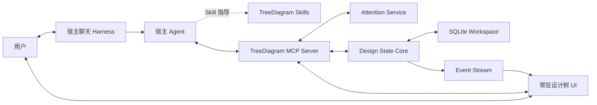

# TreeDiagram V2 整体设计

> 状态：新一轮设计基线
>
> 日期：2026-08-09
>
> 前代归档：`archive/v1-harness-baseline-2026-08-09`

## 1. 产品定义

TreeDiagram V2 是一个面向 AI Agent 协作的持久设计空间。

它不再自建完整 Agent Harness，也不以固定 Workflow 面板作为主要入口。用户在宿主 Harness
（例如 Codex、Hermes 或其他 MCP 客户端）中自然对话；TreeDiagram 提供一棵常时存在、可直接
选择的设计树，作为用户与 Agent 共享的设计状态、注意力位置和变更确认界面。

一句话定义：

> 聊天承载时间连续的讨论，设计树承载空间稳定的共识；用户通过选择树节点直接控制 Agent 的关注点与工作边界。

### 1.1 核心价值

1. **持久对齐**：重要目标、约束、假设、证据、选项和决策不随聊天上下文压缩而消失。
2. **直接指向**：用户通过选择、固定或组合节点，明确告诉 Agent“现在讨论哪里”。
3. **可见工作**：用户可以看到 Agent 正在读取什么、准备修改什么、哪些内容仍待确认。
4. **宿主原生智能**：对话、澄清、工具循环、上下文管理和一般失败恢复由宿主 Harness 负责。
5. **确定性治理**：Schema、权限、修订、ChangeSet、一致性和 Release 仍由 TreeDiagram 内核裁决。

### 1.2 非目标

- 不再实现通用聊天客户端或模型供应商适配层。
- 不再把 Initialize、Derive、Grill、Unbox、Re-evaluate 固化为服务端运行状态机。
- 不要求 Agent 一次生成完整设计树或大型结构化项目投影。
- 不把节点选择等同于立即调用模型。
- 不把聊天记录复制为 TreeDiagram 的第二份会话真相源。
- 不假定所有宿主都支持相同的嵌入式 UI、消息注入或持久侧栏能力。

## 2. 关键架构决定

### 2.1 双主交互面

V2 不是“聊天主、树辅”，也不是“树主、聊天辅”。两者承担不同且不可替代的职责：

| 交互面 | 负责 | 不负责 |
| --- | --- | --- |
| 宿主聊天 | 意图表达、追问、解释、推理、任务连续性 | 长期设计真相、修订治理 |
| 常驻设计树 | 空间定位、状态对齐、范围选择、差异检查、人工确认 | 自建模型循环、替代自然语言讨论 |
| MCP | 查询、上下文装配、受控提案、校验、同步 | 决定用户意图、隐藏执行权限 |

### 2.2 TreeDiagram 是状态服务，不是上层 Harness

TreeDiagram 负责：

- 设计节点、关系、修订和历史；
- Working ChangeSet 与稳定 Release；
- 一致性检查、影响分析和权限规则；
- 用户与 Agent 的共享注意力状态；
- 树 UI 与宿主 Agent 之间的事件同步；
- 对 Agent 可操作、可修复的结构化错误。

宿主 Harness 负责：

- 模型选择、推理和上下文窗口；
- 聊天消息与会话生命周期；
- 澄清、反问和多轮迭代；
- 工具调用循环与一般重试；
- Skill 选择和任务级编排；
- 宿主提供的审批、权限与通知机制。

### 2.3 UI 在协议上可选，在交互产品中核心

MCP 工具必须在无 UI 的客户端中可用，因此 UI 对协议是可选层。但对面向人的 TreeDiagram
产品体验，常驻设计树是一级能力，不是结果卡片或临时预览。

优先表现形态：

1. 宿主支持兼容的 MCP Apps UI 时，在会话附近嵌入树组件；
2. 宿主不能固定或持久显示组件时，使用共享同一 MCP 服务的本地 Sidecar 窗口；
3. 纯 CLI/自动化场景使用无头 MCP 工具，不降低领域能力。

任何关键流程都不得依赖某个宿主私有 UI API。增强能力必须进行 feature detection，并提供 Sidecar
或纯工具降级路径。

## 3. 总体架构



### 3.1 分层

#### Host Adapter

面向特定宿主的薄层，只处理安装、能力探测、会话标识、UI 打开方式和宿主特有的消息桥接。
Host Adapter 不包含领域规则。

#### Skills

向 Agent 描述何时读取设计树、如何选择上下文、怎样形成小步提案、何时询问用户以及什么算完成。
Skills 是工作方法，不是持久运行实例。

#### MCP Server

暴露稳定、跨宿主的读取、注意力、提案、检查和确认工具。所有工具返回结构化结果与简洁的模型可读
摘要。MCP Server 不自行调用模型。

#### Design State Core

保存 V1 中已经验证有价值的领域能力：节点与关系修订、ChangeSet、Release、权限、一致性、影响分析
和审计。Core 不依赖 MCP、HTTP、React 或任何具体宿主。

#### Persistent Tree UI

持续呈现设计空间、用户焦点、Agent 焦点、候选变更、影响范围和确认状态。相同前端核心可作为
MCP App 或独立 Sidecar 运行。

## 4. 四类状态的边界

V2 必须避免再次把会话状态、工作流状态和设计状态混合。

| 状态 | 权威持有者 | 生命周期 |
| --- | --- | --- |
| Conversation State | 宿主 Harness | 宿主会话 |
| Attention State | TreeDiagram Attention Service | 会话/客户端作用域，可恢复 |
| Working Design State | TreeDiagram ChangeSet | 跨会话持久化，直到采用或放弃 |
| Released Design State | TreeDiagram Release | 长期稳定、可供下游消费 |

聊天中形成的想法只有在 Agent 或用户明确创建提案后才进入 Working Design State。选择节点只改变
Attention State，不修改设计事实。

## 5. Attention Context

### 5.1 目的

Attention Context 是 V2 的关键新协议。它让用户和 Agent 对“当前正在讨论什么”拥有同一份明确、
可见但不污染设计事实的状态。

建议数据结构：

```ts
interface AttentionContext {
  id: string;
  workspaceId: string;
  hostKind: string;
  hostSessionRef?: string;
  clientRef: string;
  primaryNodeId?: string;
  selectedNodeIds: string[];
  pinnedNodeIds: string[];
  scope: "node" | "subtree" | "related" | "comparison";
  intentHint?: string;
  updatedBy: "user" | "agent";
  version: number;
  updatedAt: string;
}
```

### 5.2 语义区分

- **Selected**：UI 当前选择，允许频繁变化。
- **Primary Focus**：下一条用户消息默认指向的主要节点。
- **Pinned**：任务期间必须纳入上下文的节点，不随普通选择变化。
- **Scope**：Agent 当前读取或提出变更的结构范围。
- **Agent Focus**：Agent 本轮实际读取/操作的位置，与用户选择分别显示。

### 5.3 交互原则

默认采用：

> 选择即设定上下文，发言或明确动作才触发 Agent 工作。

单击节点不自动产生模型调用。树 UI 应在聊天输入区域或自身顶部清楚显示当前焦点。用户可以：

- 选择一个节点作为焦点；
- 多选节点进行比较；
- 固定根目标、约束或证据；
- 把工作范围限制为节点、子树或关联图；
- 点击“围绕此节点继续”等明确动作生成宿主消息。

### 5.4 并发与隔离

Attention Context 默认按宿主会话和客户端隔离，不能使用一个全局 `selectedNodeId`。多个 Agent 或窗口
可以同时查看同一设计空间而不覆盖彼此焦点。

设计变更通过 ChangeSet 和乐观并发控制协调；注意力冲突不应升级为设计冲突。

## 6. 核心用户体验

### 6.1 从节点继续讨论

1. 用户在常驻树中选择节点。
2. UI 更新 Attention Context，并显示焦点徽标。
3. 用户在宿主聊天中输入自然语言任务。
4. Agent 读取当前焦点的最小上下文包。
5. Agent 在聊天中澄清或解释，并通过 MCP 形成小步候选变更。
6. UI 实时显示 Agent 焦点和候选差异。
7. 用户继续聊天，或在树中编辑、确认、拒绝。

### 6.2 直接动作

树 UI 可以提供少量意图按钮，但按钮只生成清楚的宿主消息或工具意图，不启动 TreeDiagram 内部工作流：

- 围绕此节点继续；
- 从这里向下推导；
- 质疑此分支；
- 比较所选节点；
- 查找遗漏依赖；
- 解释候选变更；
- 检查受影响范围。

Agent 根据自然语言和当前 Skill 决定实际工具调用序列。

### 6.3 Agent 可见性

树必须区分显示：

- 用户当前选择；
- Agent 当前读取焦点；
- Agent 本轮建议新增/修改/移除的节点；
- 仍待澄清的语义问题；
- 等待用户确认的高影响变更；
- 已发布 Release 与 Working ChangeSet 的差异。

## 7. Skill 设计

V1 的工作流名称可以保留为可组合 Skills，但不再拥有固定服务端状态机。

### 7.1 Initialize Skill

- 从用户材料和对话中逐步提炼目标、约束与假设；
- 信息模糊时直接在宿主聊天中询问；
- 以多个小 ChangeSet 提案建立根部，而非一次输出完整项目投影；
- 根部确认仍要求显式用户操作。

### 7.2 Derive Skill

- 从 Attention Context 获取焦点；
- 查找未展开维度、相关约束和已有决策；
- 逐步提出节点和关系；
- 每轮保持变更规模可审查。

### 7.3 Grill Skill

- 默认只读分析；
- 将问题作为聊天结论、诊断标记或候选节点提出；
- 不因发现问题而把任务标记为技术失败。

### 7.4 Unbox Skill

- 在用户明确要求重新打开设计空间时使用；
- 先改变问题边界，再形成结构化候选；
- 不把普通失败重试伪装成 Unbox。

### 7.5 Re-evaluate Skill

- 由已采用的高影响变更或用户意图触发；
- 读取确定性影响闭包；
- Agent 分批审查语义影响；
- TreeDiagram 负责最终一致性检查和 Release 闸门。

## 8. MCP 工具面

工具应小而可组合，让 Agent 可以根据每一步结果调整行为。工具名为初始方向，不在本设计阶段锁死。

### 8.1 读取工具

- `design_workspace_get`
- `design_tree_get`
- `design_node_get`
- `design_query`
- `design_relations_get`
- `design_context_get`
- `design_changeset_get`
- `design_impact_get`

`design_context_get` 接受 Attention Context 或显式节点范围，返回根路径、焦点节点、直接关系、相关约束、
决策、证据、候选差异和预算内摘要，而不是把整棵树塞入模型上下文。

### 8.2 注意力工具

- `attention_get`
- `attention_set`
- `attention_pin`
- `attention_clear`
- `attention_agent_focus_set`

这些工具不得修改节点或 ChangeSet。

### 8.3 提案工具

- `changeset_begin`
- `design_change_propose`
- `design_change_revise`
- `design_change_discard`
- `changeset_validate`

提案工具允许 Agent 小步修正。Schema 错误应返回准确字段路径、期望值、实际值和可否自动重试，而不是
把整个任务置为 `failed`。

### 8.4 高权限工具

- `changeset_adopt`
- `design_release_publish`
- `delegation_policy_set`
- `design_root_change_confirm`

高权限工具必须要求可验证的用户确认或宿主审批上下文。Agent 的自然语言声明不能代替授权。

## 9. 错误与恢复模型

V2 不再以一个 WorkflowRun 的 `failed` 代表所有异常。每次工具调用返回以下错误类别之一：

| 类别 | 处理者 | 示例 |
| --- | --- | --- |
| `agent_recoverable` | Agent 可调整参数并重试 | Schema、字段缺失、变更过大 |
| `user_input_required` | Agent 在聊天中询问用户 | 目标模糊、候选冲突需取舍 |
| `state_conflict` | Agent 刷新状态后重放或合并 | revision/version 已变化 |
| `permission_required` | 宿主或 Tree UI 请求确认 | 根部变更、发布、扩大托管范围 |
| `infrastructure_failure` | 系统报告并允许重试 | 数据库不可用、MCP 连接中断 |

错误响应至少包含：

```ts
interface ToolError {
  code: string;
  category:
    | "agent_recoverable"
    | "user_input_required"
    | "state_conflict"
    | "permission_required"
    | "infrastructure_failure";
  message: string;
  path?: string;
  expected?: unknown;
  actual?: unknown;
  retryable: boolean;
  suggestedAction?: string;
}
```

Agent 连续产生低质量结果不是基础设施失败。它可以继续解释、缩小范围、询问用户或修改同一 ChangeSet，
无需用户寻找“重试失败阶段”按钮。

## 10. UI 设计

### 10.1 常驻布局

树 UI 的最小长期布局：

1. **设计树与搜索**：层级、过滤、多选、固定、跨分支标记；
2. **共享焦点栏**：用户焦点、Agent 焦点、当前 Scope 和宿主会话；
3. **节点检查器**：正文、类型化字段、关系、证据、历史；
4. **候选差异层**：新增、修改、移除和影响范围；
5. **确认区**：接受、拒绝、编辑、要求解释；
6. **活动提示**：Agent 正在读取或提出变更的位置，不展示私有思维链。

不再提供 Workflow 类型下拉框和内部聊天历史面板。自然语言入口属于宿主。

### 10.2 MCP App 与 Sidecar

前端核心使用宿主无关的数据和动作接口：

- MCP App 模式通过标准桥接接收工具输入/结果、调用工具和发送后续消息；
- Sidecar 模式通过本地 HTTP/MCP gateway 与同一服务通信；
- 两种模式订阅相同事件并渲染相同 Attention Context；
- 宿主私有状态只能作为增强缓存，不能成为权威状态。

OpenAI 插件架构参考：

- <https://developers.openai.com/plugins/concepts/plugins>
- <https://developers.openai.com/plugins/build/chatgpt-ui>

Hermes MCP 兼容参考：

- <https://hermes-agent.nousresearch.com/docs/user-guide/features/mcp>

## 11. 数据与事件

### 11.1 保留的领域实体

- Project / Workspace
- Node / NodeRevision
- Relation / RelationRevision
- ChangeSet
- Release
- DelegationPolicy
- ReviewItem
- SourceAsset
- EventOutbox

### 11.2 新增实体

- AttentionContext
- HostSessionBinding
- UIClientPresence（可选、短期）
- AgentActivity（仅公开当前阶段、焦点和工具结果，不保存私有推理）

### 11.3 退出默认产品路径的实体

- WorkflowRun
- WorkflowMessage
- WorkflowWait
- WorkflowIssue
- ModelCallTrace

迁移期间这些表保持只读兼容，用于查看 V1 历史；V2 不再向其中写入新运行。

### 11.4 事件

建议事件包括：

- `attention.updated`
- `agent.focus.changed`
- `changeset.updated`
- `design.validation.changed`
- `design.invalidated`
- `release.published`
- `host.session.bound`

Attention 高频事件与设计审计事件应使用不同保留策略，避免选择操作污染长期审计日志。

## 12. 安全与权限

- MCP 读取与写入工具分级暴露；宿主可以只安装只读工具集。
- 节点选择不授予写权限。
- Agent 只能提出变更，除非存在明确的分支托管策略。
- 根部确认、Release 发布和托管范围扩大始终需要用户确认。
- 工具返回中标注副作用和授权需求。
- Sidecar 默认只监听 loopback；远程 MCP 必须有独立认证与最小权限。
- HostSessionBinding 不保存宿主完整聊天内容，只保存不透明会话引用。

## 13. 宿主能力分级

### Level 0：Headless MCP

宿主只能调用工具。Agent 通过文本引用节点，用户用独立 Tree UI 检查状态。

### Level 1：共享 Attention

宿主会话可以绑定 Attention Context；下一轮 Agent 自动读取用户选择。

### Level 2：交互式 MCP UI

组件可以调用工具、更新模型可见上下文、发送后续消息。选择节点能够自然进入聊天回路。

### Level 3：常驻宿主面板

宿主允许固定树面板并同步输入框焦点。这是最佳体验，但不是跨宿主基线要求。

TreeDiagram 的核心语义必须在 Level 0 成立，质变体验从 Level 1 开始，Level 2/3 提供最佳整合。

## 14. V1 资产处置

完整 V1 standalone harness 已由 Git tag `archive/v1-harness-baseline-2026-08-09` 冻结。新分支中的旧代码
仅作为迁移来源，不再代表产品方向。

### 14.1 保留并演进

- `packages/contracts` 中的领域类型和 Schema；
- `packages/core` 中与模型无关的数据库、服务和一致性规则；
- 节点、关系、修订、ChangeSet、Release 的测试；
- Web 树、Inspector 和差异组件中可复用的视图逻辑；
- 本地优先、可审计、确定性写入原则。

### 14.2 替换

- 模型 Provider 与 Workflow Runner → 宿主 Agent + Skills；
- Workflow HTTP API → MCP 工具面；
- WorkflowPanel → 宿主聊天绑定与共享焦点栏；
- readiness/proposal/repair 大调用 → 多轮、小步工具提案；
- workflow retry → 工具级可恢复错误与 Agent 自修正。

### 14.3 暂时兼容

- 原 HTTP API 可作为 Sidecar UI 的过渡传输层；
- V1 Workflow 历史只读展示；
- 原 Web UI 在 Attention UI 完成前可继续作为领域调试器。

## 15. 迁移顺序

1. **冻结 V1**：建立归档 tag，停止向旧 Workflow 架构添加特性。
2. **切出宿主无关内核**：确认 Core 不依赖模型、Fastify、React 或宿主对象。
3. **定义 MCP 契约**：先实现读取、Attention 和小步提案工具。
4. **建立共享注意力**：实现 session-scoped Attention Context 与事件同步。
5. **改造常驻树 UI**：移除 WorkflowPanel，加入焦点、范围、Agent 活动和消息动作。
6. **编写 Skills**：Initialize、Derive、Grill、Unbox、Re-evaluate 转为宿主工作方法。
7. **接入首个宿主**：选择一个支持范围明确的宿主完成贯穿闭环。
8. **接入第二宿主**：验证 MCP 核心未被首个宿主私有能力污染。
9. **停写 V1 Workflow 表**：保留历史读取和迁移工具。

每一步都应保持设计数据可读，并允许从归档 tag 恢复旧应用。

## 16. 首个贯穿验收场景

1. 用户在宿主聊天中描述一个模糊项目。
2. Agent 使用 Initialize Skill 对话澄清，不创建失败的 WorkflowRun。
3. Agent 分批提出根目标、约束和假设，常驻树实时出现候选。
4. 用户在树中选择一个约束，聊天输入区域显示该焦点。
5. 用户说“检查这个限制是否过早”。
6. Agent 自动读取焦点上下文并使用 Grill/Unbox 方法分析。
7. Agent 的第一次提案 Schema 不合法时，工具返回字段级错误，Agent 自行修正。
8. 用户多选两个候选节点并要求比较，Agent 获得 comparison scope。
9. 用户在树中确认选定变更，未确认变更继续保留在 ChangeSet。
10. 发布前由确定性检查器验证一致性和权限，用户显式发布 Release。
11. 关闭宿主会话后重新进入，设计状态、ChangeSet 和固定焦点仍可恢复；聊天历史继续由宿主管理。

## 17. 验收原则

- 用户无需选择 Workflow 类型即可从任意节点继续工作。
- 用户选择的焦点在 Agent 下一轮调用中可验证地生效。
- Agent 实际读取的焦点和修改范围对用户可见。
- 选择节点不会自动修改设计或产生模型费用。
- 可恢复 Schema 错误返回给 Agent 后能在同一对话中自修正。
- 用户澄清不会留下 `failed` 的 TreeDiagram 工作流状态。
- Tree UI 关闭不影响 Agent 使用 MCP；宿主关闭不影响设计状态持久化。
- 同一 MCP Server 至少能被两个宿主使用，且领域行为一致。
- 高权限操作不能由 Agent 绕过用户确认。
- V1 归档可以完整构建和恢复。

## 18. 当前未决事项

1. 首个落地宿主选择 Codex 还是 Hermes，以及目标版本的 UI 能力边界。
2. Attention Context 的默认恢复期限和跨会话继承规则。
3. 嵌入式 MCP UI 与独立 Sidecar 的首发优先级。
4. ChangeSet 是否允许多个宿主会话并行写入，还是 V2 首版保持单写者。
5. 用户确认如何形成跨宿主可验证、不可伪造的授权凭据。
6. 原 V1 工作区的自动迁移、只读打开和回滚策略。

这些问题进入下一轮收敛设计，不影响本文件确定的产品边界。
