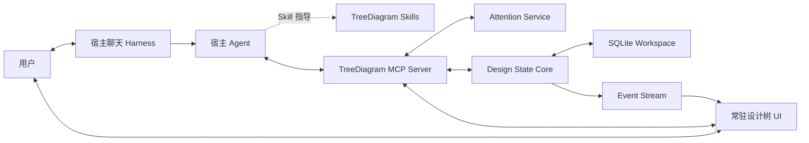

# TreeDiagram V2 整体设计

> 状态：V2 架构决策基线
>
> 日期：2026-08-09
>
> 前代归档：`archive/v1-harness-baseline-2026-08-09`

## 1. 产品定义

TreeDiagram V2 是一个面向 AI Agent 协作的持久设计空间。

它不再自建完整 Agent Harness，也不以固定 Workflow 面板作为主要入口。用户在宿主 Harness
（例如 Codex、Hermes 或其他 MCP 客户端）中自然对话；TreeDiagram 提供一棵常时存在、可直接
选择的设计树，作为用户与 Agent 共享的设计状态、注意力位置和变更确认界面。

一句话定义：

> 聊天承载时间连续的讨论，设计树承载空间稳定的共识；用户通过选择树节点直接控制 Agent 的关注点与工作边界。

### 1.1 核心价值

1. **持久对齐**：重要目标、约束、假设、证据、选项和决策不随聊天上下文压缩而消失。
2. **直接指向**：用户通过选择、固定或组合节点，明确告诉 Agent“现在讨论哪里”。
3. **可见工作**：用户可以看到 Agent 正在读取什么、准备修改什么、哪些内容仍待确认。
4. **宿主原生智能**：对话、澄清、工具循环、上下文管理和一般失败恢复由宿主 Harness 负责。
5. **确定性治理**：Schema、权限、修订、ChangeSet、一致性和 Release 仍由 TreeDiagram 内核裁决。

### 1.2 非目标

- 不再实现通用聊天客户端或模型供应商适配层。
- 不再把 Initialize、Derive、Grill、Check、Unbox、Re-evaluate 固化为服务端运行状态机。
- 不要求 Agent 一次生成完整设计树或大型结构化项目投影。
- 不把节点选择等同于立即调用模型。
- 不把聊天记录复制为 TreeDiagram 的第二份会话真相源。
- 不假定所有宿主都支持相同的嵌入式 UI、消息注入或持久侧栏能力。

## 2. 关键架构决定

### 2.1 双主交互面

V2 不是“聊天主、树辅”，也不是“树主、聊天辅”。两者承担不同且不可替代的职责：

| 交互面     | 负责                                             | 不负责                         |
| ---------- | ------------------------------------------------ | ------------------------------ |
| 宿主聊天   | 意图表达、追问、解释、推理、任务连续性           | 长期设计真相、修订治理         |
| 常驻设计树 | 空间定位、状态对齐、范围选择、差异检查、人工确认 | 自建模型循环、替代自然语言讨论 |
| MCP        | 查询、上下文装配、受控提案、校验、同步           | 决定用户意图、隐藏执行权限     |

### 2.2 TreeDiagram 是状态服务，不是上层 Harness

TreeDiagram 负责：

- 设计节点、关系、修订和历史；
- Working ChangeSet 与稳定 Release；
- 一致性检查、影响分析和权限规则；
- 用户与 Agent 的共享注意力状态；
- 树 UI 与宿主 Agent 之间的事件同步；
- 对 Agent 可操作、可修复的结构化错误。

宿主 Harness 负责：

- 模型选择、推理和上下文窗口；
- 聊天消息与会话生命周期；
- 澄清、反问和多轮迭代；
- 工具调用循环与一般重试；
- Skill 选择和任务级编排；
- 宿主提供的审批、权限与通知机制。

### 2.3 UI 在协议上可选，在交互产品中核心

MCP 工具必须在无 UI 的客户端中可用，因此 UI 对协议是可选层。但对面向人的 TreeDiagram
产品体验，常驻设计树是一级能力，不是结果卡片或临时预览。

首发采用 **Sidecar-first，Embedded-enhanced**：

1. 本地 Sidecar 提供完整、可常驻的设计树体验；
2. 宿主支持兼容的 MCP Apps UI 时，复用同一前端核心提供嵌入式增强；
3. 纯 CLI/自动化场景使用无头 MCP 工具，不降低领域能力。

任何关键流程都不得依赖某个宿主私有 UI API。增强能力必须进行 feature detection，并提供 Sidecar
或纯工具降级路径。Sidecar 不是临时过渡实现，而是跨宿主一致体验的正式产品表面。

### 2.4 宿主策略

V2 采用 **Codex-first，Hermes-second**：

- Codex 是首个参考宿主，用于完成 Skill、MCP、Attention 与 Sidecar 的端到端闭环；
- Hermes 是第二宿主兼容性门禁，用于验证 MCP Core 和工具语义没有被 Codex 私有能力污染；
- 在 Hermes 贯穿验收通过前，MCP 工具契约不标记为跨宿主稳定版；
- Host Adapter 可以使用宿主增强能力，但 Domain、Attention 和 MCP 工具不得按产品名分支。

该策略选择的是开发和验证顺序，不表示 TreeDiagram 成为 Codex 专属产品。

Codex Host Adapter 以 `SessionStart.cwd` 作为 workspace 绑定根，而不是使用全局默认目录或固定
`workspace-v2`。项目事实保存在 `<cwd>/.treediagram`；任务标识只参与 Attention 与 lease 身份，不参与
项目路径选择。插件 Hook 负责幂等初始化和 Sidecar 可用性，Codex 托管的 stdio MCP 子进程负责工具
生命周期。Sidecar 端口按项目稳定派生并在冲突时后移，因此多个项目可以同时运行而不共享设计状态。

## 3. 总体架构



### 3.1 分层

#### Host Adapter

面向特定宿主的薄层，只处理安装、能力探测、会话标识、UI 打开方式和宿主特有的消息桥接。
Host Adapter 不包含领域规则。

#### Skills

向 Agent 描述何时读取设计树、如何选择上下文、怎样形成小步提案、何时询问用户以及什么算完成。
Skills 是工作方法，不是持久运行实例。

#### MCP Server

暴露稳定、跨宿主的读取、注意力、提案、检查和确认工具。所有工具返回结构化结果与简洁的模型可读
摘要。MCP Server 不自行调用模型。

#### Design State Core

保存 V1 中已经验证有价值的领域能力：节点与关系修订、ChangeSet、Release、权限、一致性、影响分析
和审计。Core 不依赖 MCP、HTTP、React 或任何具体宿主。

#### Persistent Tree UI

持续呈现设计空间、用户焦点、Agent 焦点、候选变更、影响范围和确认状态。相同前端核心可作为
MCP App 或独立 Sidecar 运行。

## 4. 四类状态的边界

V2 必须避免再次把会话状态、工作流状态和设计状态混合。

| 状态                  | 权威持有者                    | 生命周期                     |
| --------------------- | ----------------------------- | ---------------------------- |
| Conversation State    | 宿主 Harness                  | 宿主会话                     |
| Attention State       | TreeDiagram Attention Service | 会话/客户端作用域，可恢复    |
| Working Design State  | TreeDiagram ChangeSet         | 跨会话持久化，直到采用或放弃 |
| Released Design State | TreeDiagram Release           | 长期稳定、可供下游消费       |

聊天中形成的想法只有在 Agent 或用户明确创建提案后才进入 Working Design State。选择节点只改变
Attention State，不修改设计事实。

## 5. Attention Context

### 5.1 目的

Attention Context 是 V2 的关键新协议。它让用户和 Agent 对“当前正在讨论什么”拥有同一份明确、
可见但不污染设计事实的状态。

建议数据结构：

```ts
interface AttentionContext {
  id: string;
  workspaceId: string;
  hostKind: string;
  hostSessionRef?: string;
  clientRef: string;
  primaryNodeId?: string;
  primaryChangeId?: string;
  selectedNodeIds: string[];
  selectedChangeIds: string[];
  pinnedNodeIds: string[];
  scope: 'node' | 'subtree' | 'related' | 'comparison';
  intentHint?: string;
  updatedBy: 'user' | 'agent';
  version: number;
  updatedAt: string;
}
```

### 5.2 语义区分

- **Selected**：UI 当前选择，允许频繁变化。
- **Primary Focus**：下一条用户消息默认指向的主要 Working 节点或候选变更。
- **Pinned**：任务期间必须纳入上下文的节点，不随普通选择变化。
- **Scope**：Agent 当前读取或提出变更的结构范围。
- **Agent Focus**：Agent 本轮实际读取/操作的位置，与用户选择分别显示。

### 5.3 交互原则

默认采用：

> 选择即设定上下文，发言或明确动作才触发 Agent 工作。

单击节点或候选不自动产生模型调用，但会写入当前项目的“Agent 可见焦点”。树 UI 应明确标记该选择可由 Agent 通过 `attention_get` 读取。用户可以：

- 选择一个节点作为焦点；
- 选择候选节点或关系，要求 Agent 优先解释、修订或继续推导该候选；
- 跨节点和候选多选比较；
- 固定根目标、约束或证据；
- 把工作范围限制为节点、子树或关联图；
- 点击“围绕此节点继续”等明确动作生成宿主消息。

### 5.4 并发与隔离

Attention Context 的写入按 workspace 和宿主会话隔离，不能使用一个跨项目的全局 `selectedNodeId`。Sidecar 与 Agent 使用命名通道：Codex 为 `clientRef: "codex-agent"`，Hermes 为 `clientRef: "hermes-agent"`。Agent 读取该命名通道时，在当前 workspace 内解析同一 hostKind 最近更新的 Context，因此旧 Sidecar 标签页与新任务的 `hostSessionRef` 不一致时仍能确定性读取用户最后标记的焦点；不同项目仍完全隔离。

设计变更通过 ChangeSet 和乐观并发控制协调；注意力冲突不应升级为设计冲突。

### 5.5 生命周期与恢复

设计事实的人工查看不得依赖一次 Agent 会话。宿主 Hook 和 MCP 启动器负责会话内的自动恢复，但产品还必须提供宿主之外的独立打开入口：用户选择一个已有项目后，入口只验证现有 workspace、幂等恢复该项目 Sidecar 并打开浏览器；它不得隐式创建 workspace、启动模型调用或生成 ChangeSet。这样用户可以在决定是否继续对话之前先阅读设计树，同时仍由项目路径和 workspaceId 保证隔离。

Attention 使用分层生命周期：

| 字段/状态           | 作用域       | 恢复规则                                |
| ------------------- | ------------ | --------------------------------------- |
| `selectedNodeIds`   | host session | UI 独立恢复；Agent 读取项目最新命名通道 |
| `selectedChangeIds` | host session | UI 独立恢复；Agent 读取项目最新命名通道 |
| `primaryNodeId`     | host session | 同一宿主会话自动恢复                    |
| `primaryChangeId`   | host session | 同一宿主会话自动恢复                    |
| `pinnedNodeIds`     | host session | 持续到用户明确取消                      |
| `scope`             | host session | 同一任务自动恢复                        |
| `agentFocus`        | 单轮工具活动 | 调用结束后转为短期活动记录              |

Attention 的身份键至少包含 `workspaceId + hostKind + hostSessionRef + clientRef`。

新宿主会话不得静默继承旧会话焦点。若存在可恢复的上次焦点，Sidecar 只提示用户“恢复上次焦点”；
确认后复制为新的 Attention Context。项目根目标等长期设计事实始终通过 Design State 装配，不依赖
Attention 固定。

## 6. 核心用户体验

### 6.1 从节点继续讨论

1. 用户在常驻树中选择节点。
2. UI 更新 Attention Context，并显示焦点徽标。
3. 用户在宿主聊天中输入自然语言任务。
4. Agent 读取当前焦点的最小上下文包。
5. Agent 在聊天中澄清或解释，并通过 MCP 形成小步候选变更。
6. UI 实时显示 Agent 焦点和候选差异。
7. 用户继续聊天，或在树中编辑、确认、拒绝。

### 6.2 直接动作

树 UI 可以提供少量意图按钮，但按钮只生成清楚的宿主消息或工具意图，不启动 TreeDiagram 内部工作流：

- 围绕此节点继续；
- 从这里向下推导；
- 追问我厘清此分支；
- 检查此分支；
- 比较所选节点；
- 查找遗漏依赖；
- 解释候选变更；
- 检查受影响范围。

Agent 根据自然语言和当前 Skill 决定实际工具调用序列。

### 6.3 Agent 可见性

树必须区分显示：

- 用户当前选择；
- Agent 当前读取焦点；
- Agent 本轮建议新增/修改/移除的节点；
- 仍待澄清的语义问题；
- 等待用户确认的高影响变更；
- 已发布 Release 与 Working ChangeSet 的差异。

## 7. Skill 设计

V1 的工作流名称可以保留为可组合 Skills，但不再拥有固定服务端状态机。

### 7.1 Initialize Skill

- 从用户材料和对话中逐步提炼目标、约束与假设；
- 信息模糊时直接在宿主聊天中询问；
- 以多个小 ChangeSet 提案建立根部，而非一次输出完整项目投影；
- 根部确认仍要求显式用户操作。

### 7.2 Derive Skill

- 从 Attention Context 获取焦点；
- 查找未展开维度、相关约束和已有决策；
- 逐步提出节点和关系；
- 每轮保持变更规模可审查。

### 7.3 Grill Skill

交互语义参考 [`mattpocock/skills` 的 grilling primitive](https://github.com/mattpocock/skills/blob/main/skills/productivity/grilling/SKILL.md)，并适配 TreeDiagram 的 Attention、ChangeSet 和 ApprovalGrant 边界：

- 把当前计划、决策或想法建模为对话中的决策树；
- 按依赖已满足的“问题前沿”分轮追问，每题给出 Agent 推荐答案并等待用户裁决；
- 可从代码、工具和设计状态查到的事实由 Agent 自行查找，不把事实检索转嫁给用户；
- 所有重要分支走完且用户确认共同理解之前，不执行实现、不写入设计候选。

### 7.4 Check Skill

- 对当前焦点执行一次性只读审查，输出证据缺口、矛盾、薄弱决策、冲突约束和遗漏风险；
- 用户只要求检查时不写入；明确要求记录时才形成小步问题、风险、约束、验证方法或语义关系候选；
- 不因发现设计问题而把任务标记为技术失败。

### 7.5 Unbox Skill

- 在用户明确要求重新打开设计空间时使用；
- 先改变问题边界，再形成结构化候选；
- 不把普通失败重试伪装成 Unbox。

### 7.6 Re-evaluate Skill

- 由已采用的高影响变更或用户意图触发；
- 读取确定性影响闭包；
- Agent 分批审查语义影响；
- TreeDiagram 负责最终一致性检查和 Release 闸门。

## 8. MCP 工具面

工具应小而可组合，让 Agent 可以根据每一步结果调整行为。工具名为初始方向，不在本设计阶段锁死。

### 8.1 读取工具

- `design_workspace_get`
- `design_tree_get`
- `design_node_get`
- `design_query`
- `design_relations_get`
- `design_context_get`
- `design_changeset_get`
- `design_impact_get`

`design_context_get` 接受 Attention Context 或显式节点范围，返回根路径、焦点节点、直接关系、相关约束、
决策、证据、候选差异和预算内摘要，而不是把整棵树塞入模型上下文。

### 8.2 注意力工具

- `attention_get`
- `attention_set`
- `attention_pin`
- `attention_clear`
- `attention_agent_focus_set`

这些工具不得修改节点或 ChangeSet。

### 8.3 提案工具

- `changeset_begin`
- `design_change_propose`
- `design_change_revise`
- `design_change_discard`
- `changeset_validate`

提案工具允许 Agent 小步修正。Schema 错误应返回准确字段路径、期望值、实际值和可否自动重试，而不是
把整个任务置为 `failed`。

### 8.4 高权限工具

- `changeset_adopt`
- `design_release_publish`
- `delegation_policy_set`
- `design_root_change_confirm`

高权限工具必须要求可验证的用户确认或宿主审批上下文。Agent 的自然语言声明不能代替授权。

### 8.5 ChangeSet 单写者规则

V2 首版保持一个工作区一个活动 ChangeSet，并在任一时刻只允许一个宿主会话写入。其他会话可以
并发读取和检查，但不能静默追加候选。

```ts
interface ChangeSetWriteLease {
  changeSetId: string;
  ownerHostSessionRef: string;
  baseVersion: number;
  acquiredAt: string;
  renewedAt: string;
}
```

- 每次写操作同时校验实体 `baseRevisionId` 和 ChangeSet version；
- 用户可以在 Sidecar 中显式接管写入权；
- 接管不删除已有候选，只改变后续写入者；
- 旧写入者继续提交时收到 `state_conflict`，必须刷新后重新判断；
- 多 Draft ChangeSet、自动合并和多 Agent 并行写入不进入 V2 首版。

### 8.6 ApprovalGrant

TreeDiagram 不接受“Agent 声称用户已经同意”作为高权限操作依据。用户必须通过 Sidecar 或受信宿主
审批表面生成一次性 `ApprovalGrant`：

```ts
interface ApprovalGrant {
  id: string;
  workspaceId: string;
  action: 'adopt' | 'publish' | 'confirm_root' | 'expand_delegation';
  targetDigest: string;
  expectedVersion: number;
  hostSessionRef?: string;
  expiresAt: string;
  nonce: string;
  consumedAt?: string;
}
```

Grant 与动作、目标内容摘要和版本绑定，内容发生变化后立即失效；成功执行后单次消费。宿主审批能力
可以由 Host Adapter 兑换为 TreeDiagram Grant，但不能绕过 Grant 校验。V2 本地单用户版使用数据库
记录和高熵 opaque token，不预先引入公钥基础设施。

## 9. 错误与恢复模型

V2 不再以一个 WorkflowRun 的 `failed` 代表所有异常。每次工具调用返回以下错误类别之一：

| 类别                     | 处理者                     | 示例                         |
| ------------------------ | -------------------------- | ---------------------------- |
| `agent_recoverable`      | Agent 可调整参数并重试     | Schema、字段缺失、变更过大   |
| `user_input_required`    | Agent 在聊天中询问用户     | 目标模糊、候选冲突需取舍     |
| `state_conflict`         | Agent 刷新状态后重放或合并 | revision/version 已变化      |
| `permission_required`    | 宿主或 Tree UI 请求确认    | 根部变更、发布、扩大托管范围 |
| `infrastructure_failure` | 系统报告并允许重试         | 数据库不可用、MCP 连接中断   |

错误响应至少包含：

```ts
interface ToolError {
  code: string;
  category:
    | 'agent_recoverable'
    | 'user_input_required'
    | 'state_conflict'
    | 'permission_required'
    | 'infrastructure_failure';
  message: string;
  path?: string;
  expected?: unknown;
  actual?: unknown;
  retryable: boolean;
  suggestedAction?: string;
}
```

Agent 连续产生低质量结果不是基础设施失败。它可以继续解释、缩小范围、询问用户或修改同一 ChangeSet，
无需用户寻找“重试失败阶段”按钮。

## 10. UI 设计

### 10.1 常驻布局

树 UI 的最小长期布局：

1. **设计树与搜索**：层级、过滤、多选、固定、跨分支标记；
2. **共享焦点栏**：用户焦点、Agent 焦点、当前 Scope 和宿主会话；
3. **节点检查器**：正文、类型化字段、关系、证据、历史；
4. **候选差异层**：新增、修改、移除和影响范围；
5. **确认区**：接受、拒绝、编辑、要求解释；
6. **活动提示**：Agent 正在读取或提出变更的位置，不展示私有思维链。

候选不是与设计树分离的扁平队列。UI 必须把尚未采用的节点和 `contains` 关系投影到预期树位置，使用虚线、候选徽标和候选关系提示与 Working State 区分；修订与移除候选直接标记在现有节点上。只有缺少可解析父节点的候选才进入“待定位”分组。非层级候选关系以数量和端点摘要提示，不强行伪装成树边。当用户悬停、聚焦或从树上打开关系候选时，树必须分色高亮起点和终点，候选卡则直接展示可读的端点路径。

审批面向用户呈现为自上而下的节点决策；`contains` 仍是独立领域实体和审计记录，但指向同一 ChangeSet 新节点的挂载关系从属于该子节点。依赖图使用以下确定性规则：

1. `create_relation` 只能引用 Working 节点或同一 ChangeSet 中的 `create_node` 候选；
2. 根节点可直接采用；非根 `create_node` 必须有且仅有一个指向自己的 proposed `contains`，并且该关系的父节点已经进入 Working State；
3. 采用或丢弃新子节点时，节点与其 `contains` 挂载在同一事务中原子处理，ChangeSet version 只递增一次；该 `contains` 不形成独立用户审批项；
4. 指向 proposed 新节点的 `contains` 不能独立采用；现有节点的结构调整以及所有非层级语义关系仍是独立变更，只有端点都在 Working State 时才能采用；
5. UI 必须禁用尚未轮到的子节点并显示待批准父节点；存在 proposed 变更时不能校验或发布，一致性校验同时要求每个非根节点都有唯一 `contains` 父节点。

不再提供 Workflow 类型下拉框和内部聊天历史面板。自然语言入口属于宿主。

### 10.2 MCP App 与 Sidecar

Sidecar 是 V2 首发和验收基线；MCP App 是共享前端核心上的第二表现层。前端核心使用宿主无关的
数据和动作接口：

- Sidecar 模式通过本地 HTTP/MCP gateway 与同一服务通信，并负责完整常驻布局；
- MCP App 模式通过标准桥接接收工具输入/结果、调用工具和发送后续消息；
- 两种模式订阅相同事件并渲染相同 Attention Context；
- 宿主私有状态只能作为增强缓存，不能成为权威状态。

Sidecar 后台进程不是 MCP 生命周期的子进程：Hook 或 MCP 启动器只负责启动/健康检查后退出，Sidecar
按 workspace 幂等复用并继续服务人工审查。进程记录和动态 URL 属于该项目的本地运行元数据；SQLite
中的 workspaceId 仍是权威隔离标识。插件不能绕过宿主权限，Hook 信任与首次缺失依赖安装继续服从
Codex 的审批和管理员策略。

首版必须在没有嵌入式 UI 的条件下完成全部人工确认和焦点交互。宿主提供 fullscreen、picture-in-picture、
消息桥接或状态缓存时，通过能力探测逐项启用，不根据宿主名称硬编码行为。

OpenAI 插件架构参考：

- <https://developers.openai.com/plugins/concepts/plugins>
- <https://developers.openai.com/plugins/build/chatgpt-ui>

Hermes MCP 兼容参考：

- <https://hermes-agent.nousresearch.com/docs/user-guide/features/mcp>

## 11. 数据与事件

### 11.1 核心领域实体

- Project / Workspace
- Node / NodeRevision
- Relation / RelationRevision
- ChangeSet
- Release
- DelegationPolicy
- ReviewItem
- SourceAsset
- EventOutbox

### 11.2 协作实体

- AttentionContext
- HostSessionBinding
- UIClientPresence（可选、短期）
- AgentActivity（仅公开当前阶段、焦点和工具结果，不保存私有推理）
- ChangeSetWriteLease
- ApprovalGrant

### 11.3 明确不建立的实体

- WorkflowRun
- WorkflowMessage
- WorkflowWait
- WorkflowIssue
- ModelCallTrace

这些是 V1 Harness 的运行概念，不进入 V2 Schema，也不提供兼容表。对话和运行状态由宿主持有；
TreeDiagram 只记录设计事实、共享注意力、公开 Agent 活动和受控变更。

### 11.4 事件

建议事件包括：

- `attention.updated`
- `agent.focus.changed`
- `changeset.updated`
- `design.validation.changed`
- `design.invalidated`
- `release.published`
- `host.session.bound`

Attention 高频事件与设计审计事件应使用不同保留策略，避免选择操作污染长期审计日志。

## 12. 安全与权限

- MCP 读取与写入工具分级暴露；宿主可以只安装只读工具集。
- 节点选择不授予写权限。
- Agent 只能提出变更，除非存在明确的分支托管策略。
- 根部确认、Release 发布和托管范围扩大始终需要用户确认。
- Adopt、Publish、根部确认和托管扩大必须消费与目标 digest/version 绑定的一次性 ApprovalGrant。
- 工具返回中标注副作用和授权需求。
- Sidecar 默认只监听 loopback；远程 MCP 必须有独立认证与最小权限。
- HostSessionBinding 不保存宿主完整聊天内容，只保存不透明会话引用。

## 13. 宿主能力分级

### Level 0：Headless MCP

宿主只能调用工具。Agent 通过文本引用节点，用户用独立 Tree UI 检查状态。

### Level 1：共享 Attention

宿主会话可以绑定 Attention Context；下一轮 Agent 自动读取用户选择。

### Level 2：交互式 MCP UI

组件可以调用工具、更新模型可见上下文、发送后续消息。选择节点能够自然进入聊天回路。

### Level 3：常驻宿主面板

宿主允许固定树面板并同步输入框焦点。这是最佳体验，但不是跨宿主基线要求。

TreeDiagram 的核心语义必须在 Level 0 成立，质变体验从 Level 1 开始，Level 2/3 提供最佳整合。

## 14. V1 边界与全新产品策略

完整 V1 standalone harness 已由 Git tag `archive/v1-harness-baseline-2026-08-09` 冻结。V2 作为全新
产品开发，与 V1 只共享问题背景和经过重新确认的领域概念，不承担迁移或兼容义务。

V2 明确不提供：

- V1 workspace 或数据库自动迁移；
- V1 HTTP API、Workflow API 或表结构兼容；
- V1 Workflow 历史只读展示；
- V1 与 V2 数据双写或同步；
- 在 V1 数据库上执行原地升级。

旧源码在 V2 开发分支中只作为实现参考，不是过渡运行时。可复用代码必须经过显式提取、重新命名和
V2 测试验证；不得通过持续修改 V1 Workflow 架构来“逐渐变成”V2。V2 使用新的 workspace 标识、
数据库 Schema 和应用入口。

## 15. 实施顺序

1. **冻结 V1**：归档 tag 已建立，旧产品停止功能演进。
2. **建立干净 V2 骨架**：创建新的 package/app 边界和全新 workspace Schema。
3. **实现 Design State Core**：节点、关系、修订、ChangeSet、Release 和确定性错误。
4. **实现 MCP 读取面**：完成无头查询、上下文装配和结构化错误。
5. **实现 Attention Service**：完成会话绑定、恢复提示、事件和 Agent Focus。
6. **实现 Sidecar**：以常驻树完成选择、固定、Scope、差异和 Agent 活动闭环。
7. **实现受控写入**：小步提案、单写者 lease、乐观并发和 ApprovalGrant。
8. **接入 Codex**：发布首个 Skill + MCP Host Adapter，完成端到端贯穿验收。
9. **接入 Hermes**：验证无头 MCP、Attention 和工具语义，冻结跨宿主 V1 工具契约。
10. **增加嵌入式 UI**：在兼容宿主上复用 Sidecar 前端核心，按能力逐项增强。

更详细的里程碑和完成条件见 [IMPLEMENTATION_PLAN_V2.md](./IMPLEMENTATION_PLAN_V2.md)。

## 16. 首个贯穿验收场景

1. 用户在宿主聊天中描述一个模糊项目。
2. Agent 使用 Initialize Skill 对话澄清，不创建失败的 WorkflowRun。
3. Agent 分批提出根目标、约束和假设，常驻树实时出现候选。
4. 用户在树中选择一个约束，聊天输入区域显示该焦点。
5. 用户说“检查这个限制是否过早”。
6. Agent 自动读取焦点上下文，使用 Grill 追问澄清，或使用 Check/Unbox 方法分析。
7. Agent 的第一次提案 Schema 不合法时，工具返回字段级错误，Agent 自行修正。
8. 用户多选两个候选节点并要求比较，Agent 获得 comparison scope。
9. 用户在树中确认选定变更，未确认变更继续保留在 ChangeSet。
10. 发布前由确定性检查器验证一致性和权限，用户显式发布 Release。
11. 关闭宿主会话后重新进入，设计状态和 ChangeSet 仍存在；用户明确选择是否恢复上次焦点，聊天历史
    继续由宿主管理。

## 17. 验收原则

- 用户无需选择 Workflow 类型即可从任意节点继续工作。
- 用户选择的焦点在 Agent 下一轮调用中可验证地生效。
- Agent 实际读取的焦点和修改范围对用户可见。
- 选择节点不会自动修改设计或产生模型费用。
- 可恢复 Schema 错误返回给 Agent 后能在同一对话中自修正。
- 用户澄清不会留下 `failed` 的 TreeDiagram 工作流状态。
- Tree UI 关闭不影响 Agent 使用 MCP；宿主关闭不影响设计状态持久化。
- 同一 MCP Server 至少能被两个宿主使用，且领域行为一致。
- 高权限操作不能由 Agent 绕过用户确认。
- 同一时刻只有持有 ChangeSetWriteLease 的宿主会话可以写入。
- 高权限操作只能通过与目标 digest/version 绑定的一次性 ApprovalGrant 完成。
- V2 可以从全新空 workspace 完成贯穿场景，不读取任何 V1 文件或数据库。

## 18. 已收敛决策与延后范围

### 18.1 已收敛

| 事项           | 决定                                            |
| -------------- | ----------------------------------------------- |
| 首个宿主       | Codex-first，Hermes-second                      |
| 常驻 UI        | Sidecar-first，Embedded-enhanced                |
| Attention 恢复 | 同会话自动恢复；跨会话必须由用户明确恢复        |
| ChangeSet 并发 | V2 首版一个活动 ChangeSet、一个写入 lease       |
| 用户确认       | 一次性、目标绑定、版本绑定的 ApprovalGrant      |
| V1 数据        | 不迁移、不兼容；V2 作为全新产品和全新 workspace |

### 18.2 延后到 V2 首版之后

- 多 Draft ChangeSet、自动合并和多 Agent 并行写入；
- 远程多用户协作与组织级身份系统；
- 以宿主固定面板完全替代 Sidecar；
- 不经用户恢复确认的跨会话 Attention 自动继承；
- V1 数据导入器或兼容读取器；
- 公钥签名、远程授权服务等复杂 ApprovalGrant 基础设施。
