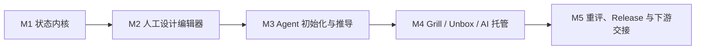

# TreeDiagram V1 — M1–M5 总体实现计划

> **已归档**：本文属于 V1 standalone Agent Harness。权威归档引用为
> `archive/v1-harness-baseline-2026-08-09`；当前方向见 [DESIGN_V2.md](./DESIGN_V2.md)。

> 实现细节：[IMPLEMENTATION_DESIGN.md](./IMPLEMENTATION_DESIGN.md)  
> HTTP 契约：[docs/API_CONTRACT.md](./docs/API_CONTRACT.md)  
> 产品验收：[V1_SPEC.md](./V1_SPEC.md)  
> 本文用途：固定里程碑顺序、交付边界和验收门禁。本文有意不提供任务级拆分；执行 Agent 必须先提交自己的任务计划与依赖分析，再开始编码。

## 1. 交付策略

V1 按五个严格递增的里程碑完成：



不得跳过里程碑。后续里程碑发现前置问题时，应先补回前置测试和实现，再继续当前任务。

## 2. Agent 规划与执行协议

Agent 开始一个里程碑时必须获得：

1. `IMPLEMENTATION_DESIGN.md`；
2. `V1_SPEC.md`；
3. M2–M5 还必须阅读 `docs/API_CONTRACT.md`；
4. 本文中当前里程碑的交付目标、非目标和全局门禁；
5. 当前仓库状态及已经完成的里程碑。

### 2.1 开始任务前

Agent 必须先完成规划，再编码：

1. 阅读当前里程碑及直接相关的实现设计章节；
2. 运行 `git status --short`，不得覆盖其他未提交修改；
3. 提交任务拆分：每项包含 ID、目标、前置依赖、允许修改的文件、测试和验收命令；
4. 给出任务依赖图，指出可并行项、共享文件冲突和关键路径；
5. 运行当前仓库 baseline command；若失败，报告失败而不是顺带修复无关问题；
6. 列出第一项任务预计修改的文件，确认没有跨里程碑实现。

### 2.2 实现期间

- 一次只完成一个由 Agent 计划定义的任务 ID。
- 新文件必须放在 `IMPLEMENTATION_DESIGN.md` 规定的目录。
- 发现需要跨层改接口时暂停，先提交 deviation 说明。
- 所有数据库变更必须使用 migration；不得手工修改测试库。
- 所有领域行为先写失败测试，再实现最小通过代码。
- UI 任务不得在浏览器端复制服务端规则。
- Agent 任务不得真实调用 OpenAI API；使用 FakeModelProvider。

### 2.3 完成任务时

Agent 必须交付：

```text
Task: <ID>
Result: complete | blocked
Files changed:
- ...
Behavior implemented:
- ...
Commands run:
- <command>: PASS/FAIL
Tests added:
- ...
Known limitations:
- none | ...
Deviation document:
- none | path
```

只有全部验收命令 PASS 才能标 complete。不得用“代码看起来正确”代替验证。

## 3. Git 与集成规则

当前仓库尚未初始化 Git。开始 M1 前先创建仓库和首个文档基线提交。

推荐：

- 主分支 `main`；
- 一个任务一个短分支：`<milestone>/<task-id>-<short-name>`；
- 一个任务一个主要提交，提交格式：`<TASK-ID> <concise description>`；
- 任务分支合并前必须 rebase/merge 最新主分支并重新跑验收；
- migration 文件一旦进入 main 不得改写；
- 不提交 `.env`、API key、workspace token、SQLite 数据库、测试临时目录或 Playwright artifacts。

如果由单一 Agent 顺序执行，也仍按任务 ID 分提交，方便定位回归。

## 4. 全局质量门禁

每个任务至少执行当前里程碑指定命令。每个里程碑结束统一执行：

```powershell
npm ci
npm run format:check
npm run typecheck
npm run test
npm run build
```

Windows PowerShell 若因 ExecutionPolicy 阻止 `npm.ps1`，上述命令及所有任务命令统一将 `npm` 替换为 `npm.cmd`。这只是调用同一 npm CLI 的平台兼容写法，不得通过降低 ExecutionPolicy 解决，也不得改用 pnpm/yarn。

M2–M5 追加：

```powershell
npm run test:e2e
```

M3–M5 可选人工 smoke，仅在用户提供 key 时执行：

```powershell
npm run test:model-smoke
```

真实模型 smoke 失败不允许通过修改业务规则掩盖；先区分配置、网络、模型拒绝、schema 和领域验证失败。

## 5. 里程碑交付物

### M1 — 状态内核

完成后必须能够：

- 初始化本地工作区和数据库；
- 纯代码创建/修订/移除节点和关系候选；
- 构造 WorkingSet；
- 检查全部 V1 blocking invariants；
- 采用 ChangeSet、生成 review items、发布/放弃 Release；
- 通过脚本读取树、关系、历史和事件；
- 使用 seeded fixture 完成 Release 1 -> candidate -> Release 2。

M1 不包含 HTTP、React 或模型调用。

### M2 — 人工设计编辑器

完成后必须能够在浏览器中纯人工：

- 创建 Source、节点、修订和关系；
- 树形浏览、搜索、检查跨分支关系；
- 查看 Release 与候选差异；
- Adopt、查看一致性问题、Abandon/Publish；
- 设置/撤销分支托管策略；
- 通过 token 鉴权和 loopback 服务安全运行。

M2 不包含模型功能，Workflow 面板只显示“尚未配置”。

### M3 — Agent 初始化与推导

完成后必须能够：

- 使用 FakeModelProvider 稳定跑 Initialize 和 Derive；
- 可选使用 OpenAI Responses API strict structured output；
- 保存 WorkflowRun 检查点并在重启后恢复；
- 将模型输出验证后写入 ChangeSet；
- 初始化时先找根，其余导入内容保持 assumed/tentative；
- 模型故障不破坏数据库或当前 Release。

### M4 — Grill、Unbox 与 AI 托管

完成后必须能够：

- 对分支执行 Grill 并生成可操作设计候选；
- 手动执行 Unbox，得到真正不同的候选分支；
- 正确创建和审查 Evidence；
- 识别重要决策并展开 Question/Option/Decision；
- 在 ai_managed 子树内自动确认，在越界时停下请求用户。

### M5 — 重评、Release 与下游交接

完成后必须能够：

- 普通变更做依赖闭包，root change 覆盖全树；
- 分批重评并保留检查点；
- 阻塞时返回直接阻塞集合；
- 非一致状态下所有下游设计读取返回 423；
- 原子发布 Release 与事件；
- 轮询事件 cursor；
- 完成程序化建模工具集贯穿验收案例。

## 6. 范围变更规则

以下情况才允许修改实现基线：

- 官方依赖无法安装或存在已确认安全问题；
- SQLite 约束无法表达且领域层替代会破坏事务不变量；
- 产品验收案例无法在既定模型中表达；
- 两份权威文档存在实际矛盾。

变更步骤：

1. 建立 `docs/implementation-deviations.md`；
2. 记录原设计、复现命令、失败证据；
3. 给出不超过两个最小替代；
4. 等待上级确认；
5. 确认后先改文档和测试，再改实现。

性能“可能更好”、个人偏好、已有熟悉技术都不是换栈理由。

## 7. V1 完成定义

只有同时满足以下条件才能宣布 V1 完成：

- M1–M5 的里程碑交付目标全部满足，Agent 自行规划的任务全部 complete；
- 全局门禁在干净 `npm ci` 后通过；
- Playwright 贯穿场景通过；
- FakeModelProvider 下所有工作流确定性通过；
- 至少一次人工 OpenAI smoke 成功或明确记录“因无 API key 未执行”；
- 工作区重启恢复测试通过；
- 5,000/20,000 规模测试通过；
- 非一致状态读取闸门无绕过路径；
- README 包含安装、初始化、运行、备份和下游读取说明；
- `IMPLEMENTATION_DESIGN.md` 的 12 条关键不变量都有自动测试覆盖。
