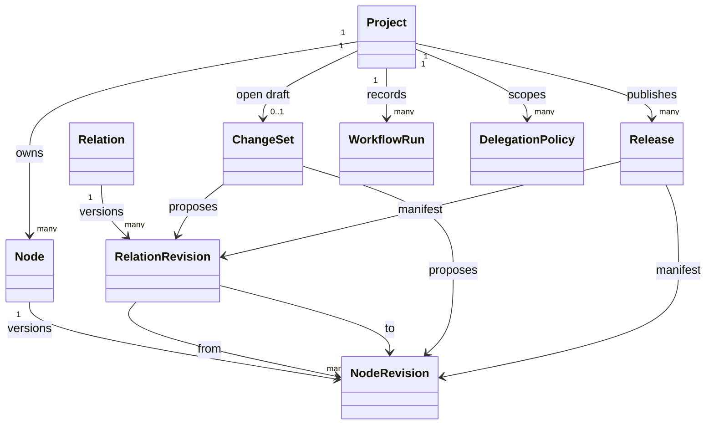
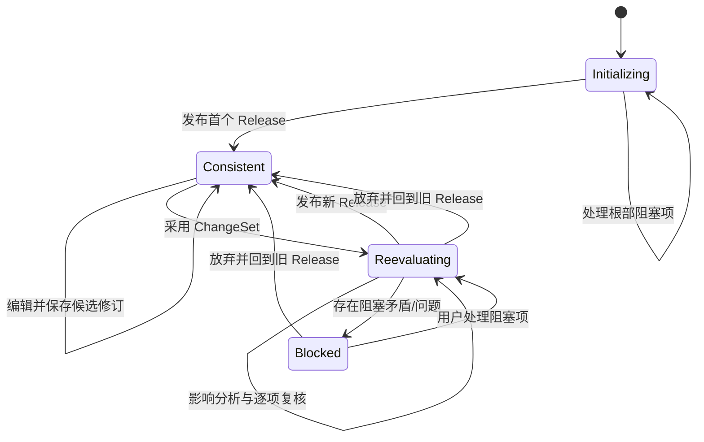
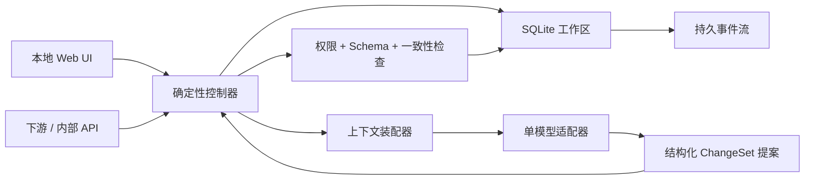

# TreeDiagram Agent Harness — V1 设计规格

> 状态：V1 基线  
> 日期：2026-08-07  
> 上游共识：[DESIGN.md](./DESIGN.md)  
> 本文用途：作为第一版实现与验收的直接依据。探索过程保留在 `DESIGN.md`，实现时以本文为准。

## 1. V1 定义

TreeDiagram V1 是一个面向独立创作者的、本地优先、单用户的长期设计工程系统。它把设计维护为一份版本化、可查询、可由 Agent 操作的设计状态，而不是把聊天记录或 Markdown 文档当作唯一真相源。

V1 只负责设计。它不生成实现计划、不执行实现、不管理代码。它通过一致的读取接口和设计变更事件，把已发布的设计交给后续框架。

### 1.1 首要价值

1. 显式、可查询的设计决策树；
2. 系统性追问与遗漏检测；
3. 证据、假设、关系和决策之间的完整溯源。

### 1.2 产品原则

- **设计状态优先**：聊天、报告和树形图都是状态的视图。
- **树负责理解，图负责表达**：一个主要父子结构用于阅读，跨分支关系形成完整语义图。
- **内容宽松，关系严格**：第一版允许模糊自然语言，但版本、状态、关系和来源必须明确。
- **Agent 提案，控制器裁决**：模型提出变更，确定性代码检查权限、状态转换和一致性。
- **稳定版本优先**：候选修订不会静默污染已发布设计；重新评估期间暂停下游消费。
- **复杂度受控**：单进程、单用户、单工作区、单模型适配器，不采用多 Agent 群、分布式队列或完整事件溯源。

## 2. V1 范围

### 2.1 必须具备

- 从自由文本、粘贴内容、Markdown 或纯文本文件启动一个设计项目。
- 由 Agent 把输入拆分为原子化候选节点，并先提炼一组设计不动点。
- 用户确认根部；其余导入内容默认按假设处理并保留来源。
- 树形浏览、搜索、过滤、节点检查、跨分支关系查看。
- Derive、Grill、Unbox、Re-evaluate 四个核心工作流，以及初始化工作流。
- 用户确认与分支级 AI 托管。
- 节点和关系的候选修订、差异、采用、影响分析与历史。
- 一致性检查、稳定 Release、下游读取闸门和变更事件。
- Agent 运行的持久化进度、恢复和结构化摘要。

### 2.2 明确不做

- 多用户、团队审批、实时协作。
- 规划、任务拆分、实现设计、实现计划或代码执行。
- 自动执行验证实验；V1 只设计验证方法。
- 外部研究、联网搜索或自动事实核验。
- PDF、Word、图片等复杂文档解析；用户可先转成文本。
- 领域 schema、插件市场或可编程领域规则。
- 多模型路由、多供应商并行或多 Agent 群体编排。
- 完整图画布；跨分支关系先在节点检查器和关系列表中呈现。
- 多个并行数据库分支、合并与冲突解决。
- 向量数据库或语义检索基础设施。
- Webhook、消息队列或外部事件总线；V1 使用可轮询的持久事件流。
- 服务关闭后继续无人值守运行。

## 3. 使用边界

### 3.1 目标用户

第一用户是使用 AI 扩展个人产能的独立创作者。系统不假设背后还有产品、研究、架构或评审团队；Agent 需要帮助一个人承担结构化分析、反方审查和设计记录工作。

### 3.2 工作节奏

- 一次集中会话通常为 20 分钟到 2 小时。
- 一个工作区伴随项目整个生命周期。
- 用户返回时看到：当前稳定版本、候选变更、待确认项、阻塞问题、最近工作流摘要。
- 只要本地服务仍在运行，持久工作流可以继续或恢复；服务退出时安全暂停。

### 3.3 工作区

V1 每个工作区只承载一个设计项目。用户可以创建多个工作区，但一个服务实例一次只打开一个工作区。工作区包含 SQLite 状态库、导入源文件副本/索引和配置。

## 4. 核心领域模型

### 4.1 逻辑节点与节点修订

`Node` 是稳定身份，只保存 ID、内核类型和创建信息。显示标题也是可发布、可追溯的设计内容，与正文、角色、属性和状态一起存在 `NodeRevision` 中；修改标题会创建候选修订。

每个修订至少包含：

- 修订 ID 与逻辑节点 ID；
- 显示标题；
- 自然语言正文；
- 一个或多个角色；
- 类型专属属性；
- 治理状态、可选认知状态；复核状态由当前 ChangeSet 的 review item 派生；
- 创建主体和来源；
- 所属 ChangeSet；
- 被其替代的旧修订；
- 创建时间。

节点采用软原子性：原则上只表达一个可独立确认、反驳或替代的语义单位。Agent 发现复合内容时建议拆分，存储层不强制拒绝。

### 4.2 内核节点类型

| 类型 | 用途 | V1 特殊属性 |
|---|---|---|
| `Topic` | 组织树形分支，不表达需要证明的命题 | 无 |
| `Claim` | 普通事实判断、设计原理、发现或推导结论 | 可选角色 |
| `Goal` | 希望设计实现、优化或保护的结果 | 可选优先级说明 |
| `Constraint` | 限制可行设计空间的条件 | `hard` 或 `soft` |
| `Risk` | 可能破坏目标或设计成立性的风险陈述 | 可选影响说明 |
| `Question` | 尚未解决且可能改变设计的未知项 | `blocking: boolean` |
| `Option` | 对问题或设计空间的候选响应 | 无 |
| `Decision` | 采用或排除方案的承诺与理由 | `importance`、`no_alternative_found` |
| `Evidence` | 支持或反驳命题的可溯源材料 | 证据种类、方法、前提、局限、来源引用 |
| `ValidationMethod` | 降低不确定性的验证设计 | 方法、目标信号、成功/失败解释 |

`Root` 不是独立类型，而是角色。V1 允许 `Claim`、`Goal` 和 `Constraint` 修订带有 `root` 角色，共同组成当前设计不动点。根部正文没有固定 schema。

### 4.3 内置角色

第一版仅内置：

- `root`：当前设计不动点成员；
- `principle`：设计原则；
- `requirement`：需求陈述；
- `finding`：由分析或验证得出的发现。

节点可拥有多个角色，也允许自定义字符串角色。自定义角色只用于查询和显示，不改变内核规则。

### 4.4 状态模型

#### 治理状态

- `draft`：尚未进入正式设计判断；
- `tentative`：暂时采用，但未最终确认；
- `user_confirmed`：由用户最终确认；
- `ai_confirmed`：在有效 AI 托管作用域内由 Agent 确认；
- `superseded`：已被新修订或新设计替代；
- `archived`：保留审计，但不参与当前设计。

#### 认知状态

仅适用于 `Claim`、`Constraint` 和 `Risk`：

- `unexamined`：尚未判断；
- `assumed`：缺少充分证据，但当前推导暂时采用；
- `supported`：至少有一条有效 `supports` 关系连接到 Evidence；
- `refuted`：已有有效证据或论证表明不成立。

治理与认知状态正交。用户可以确认“把某项作为假设使用”，但确认动作不会自动把它升级为 supported。

#### 复核状态

- `clean`：在当前工作版本下无需复核；
- `required`：上游修订或关系变化后需要重新判断；
- `blocked`：无法完成复核，需要用户决策或新证据。

复核状态是运行标记，不覆盖原有确认者信息。

### 4.5 Evidence 规则

V1 支持以下证据种类：

- `external_source`：外部文本或引用；
- `user_observation`：用户提供的经验、观察或事实陈述；
- `imported_material`：导入资料的原始内容，仅证明“来源这样写过”；
- `agent_argument`：Agent 给出的结构化论证；
- `thought_experiment`：思辨或思维实验推演。

Agent 论证和思维实验是合法 Evidence，但必须保存可审查的前提、方法、结论与局限。系统只保存结构化理由摘要，不依赖或暴露模型的私有思维链。

节点从 `assumed` 升级为 `supported` 时，必须存在至少一条活动的 `supports` 关系。导入材料与命题之间默认使用 `derived_from`，不能仅因原文声称某事就自动视为 supported。

### 4.6 完整关系实体

`Relation` 是稳定身份，`RelationRevision` 保存具体含义并锁定两端的精确节点修订。

第一版关系类型：

| 关系 | 含义 |
|---|---|
| `contains` | 主要树形归属；每个活动节点修订最多一个活动父关系 |
| `depends_on` | 目标节点的成立依赖来源节点 |
| `derived_from` | 目标由来源推导或提取 |
| `supports` | 来源 Evidence 支持目标命题 |
| `contradicts` | 两个内容不能同时成立或存在显著张力 |
| `constrains` | 来源约束目标的可行空间 |
| `addresses` | Option 或 Decision 回应 Question |
| `selects` | Decision 采用 Option |
| `rejects` | Decision 排除 Option |
| `supersedes` | 新内容或关系替代旧内容或关系 |

每个关系修订必须记录：关系类型、两端修订 ID、建立理由、类型专属属性、创建主体、治理状态、版本和所属 ChangeSet。V1 仅 `contradicts` 有 `{ blocking: boolean }` 属性，其他关系属性为空对象。复核状态由当前 ChangeSet 的 review item 派生，不能为改变运行标记而改写不可变关系修订。

结构关系也锁定修订。界面显示稳定逻辑节点；底层在任一端修订变化时显式检查关系是否仍成立，禁止静默迁移已确认关系。

## 5. 决策建模

### 5.1 重要决策

重要决策必须拥有显式 Question 和 Decision，并满足以下之一：

- 至少一个 Option，Decision 通过 `selects` 或 `rejects` 记录处理结果；
- Decision 标记 `no_alternative_found=true`，并说明搜索范围和未发现替代方案的理由。

Agent 在以下任一情况建议升级为重要决策：

- 触及根命题、Goal 或 Constraint；
- 影响多个分支；
- 存在两个以上合理方案；
- 失败代价较高；
- 依赖低可信假设；
- 下游框架会直接依赖。

用户可以升级或降级。AI 托管分支内由 Agent 判断，但根部相关决策始终需要用户确认。

### 5.2 简化决策

局部小决定只需一个 Decision 节点，正文中包含问题摘要、选择和理由。升级时，Agent 把内嵌信息展开成 Question、Option 和关系实体，原 Decision 身份保持不变或以显式新修订替代。

决策单元不是树外容器。Question、Option 和 Decision 都是普通节点；树边表示阅读归属，关系实体表示机器语义。

## 6. 修订、ChangeSet 与 Release

### 6.1 单一开放 ChangeSet

为控制复杂度，一个工作区同一时间只允许一个开放 ChangeSet。它可以长期存在并包含多个候选节点修订和关系修订。

多条设计备选方案通过 Option 和树分支表达，而不是通过多个数据库分支表达。

### 6.2 两阶段激活

规则：

1. 编辑已确认节点只创建候选修订，当前 Release 不变。
2. 用户选择“采用并重新推演”后，整个 ChangeSet 成为工作版本。
3. 项目进入 `reevaluating`，发布读取接口暂停，下游收到失效事件。
4. 系统计算影响闭包并依次复核。
5. 所有一致性条件满足后生成新 Release；否则保持 reevaluating 或 blocked。
6. 用户可以放弃本次采用，恢复最后一致 Release。

AI 托管分支可以自动采用变更，但只有在影响闭包完全位于授权范围内时才允许；否则必须请求用户。

### 6.3 影响分析

普通修订的初始影响集包括：

- 被修订节点；
- 指向旧修订或从旧修订出发的全部关系；
- 通过 `depends_on`、`derived_from`、`supports`、`constrains`、`addresses` 等关系依赖它的节点；
- 以它为语义父节点的后代。

根部成员、内容或根部关系发生变化时，所有活动节点和关系都进入复核集合。系统可以按显式依赖优先排序，但不能因缺少关系而跳过某个分支。

### 6.4 Release

Release 是下游唯一可消费的设计版本，包含：

- 单调递增版本号；
- 根命题修订集合；
- 活动节点修订 ID 集合；
- 活动关系修订 ID 集合；
- 发布时间和发布摘要。

V1 直接保存 Release manifest，不实现完整事件溯源或数据库时间旅行。

## 7. 一致性闸门

项目只有同时满足以下条件才能发布 Release：

1. 至少存在一个 `root` 角色节点，且所有根部修订均为 `user_confirmed`。
2. 所有活动节点和关系的复核状态均为 clean。
3. 每个活动节点最多拥有一个活动 `contains` 父关系，且不存在结构环。
4. 所有活动关系端点都指向工作版本中的活动修订。
5. 每个 `supported` 节点至少由一个活动 Evidence 通过 `supports` 连接。
6. 活动的已确认 Decision 不依赖 refuted 节点。
7. 重要 Decision 满足显式决策完备性规则。
8. 不存在标记为 blocking 的未解决 Question 或 blocking contradiction。
9. 每个 `ai_confirmed` 修订都能追溯到当时有效的 AI 托管策略。
10. 没有待处理的根部修改或越权影响。

未解决但不阻塞的 Question、Risk、Assumption 和 ValidationMethod 不会阻止发布；它们是长期设计状态的正常组成部分。

## 8. 分支级 AI 托管

### 8.1 策略

每个树节点可以设置：

- `human_final`：默认；Agent 只能形成 tentative 提案；
- `ai_managed`：Agent 可以在该节点及其结构后代内产生 `ai_confirmed` 修订。

策略沿 `contains` 树向下继承，离目标节点最近的显式策略优先。用户可以随时撤销；撤销不自动否定历史 AI 决策，但后续修订改回 human_final。

### 8.2 不可托管操作

无论作用域如何，以下操作必须由用户确认：

- 新增、删除或修改根部成员；
- 修改托管策略本身；
- 接受影响闭包越出托管分支的修订；
- 忽略 blocking contradiction；
- 把项目从 blocked 强制发布为 consistent。

## 9. Agent Harness

### 9.1 架构原则

V1 使用一个协调 Agent 和一个确定性工作流控制器。Derive、Grill、Unbox 不是不同常驻 Agent，而是同一 Agent 的不同工作流提示、检查表和工具权限。

模型永远不直接写数据库、不直接发布 Release，也不能自行绕过状态转换。

### 9.2 Agent 工具

第一版只提供结构化领域工具：

- `get_project_state`
- `get_tree_slice`
- `get_node_and_history`
- `query_nodes`
- `get_relations`
- `propose_nodes`
- `propose_node_revisions`
- `propose_relations`
- `set_review_result`
- `check_consistency`
- `summarize_workflow_run`

工具只形成提案或受控复核结果；采用、确认和发布由控制器按权限执行。

### 9.3 上下文装配

每次运行按焦点装配最小上下文：

- 当前根命题集合；
- 焦点节点及祖先路径；
- 一跳入边、出边和相关 Evidence；
- 直接子树的摘要而非完整正文；
- 相关 Decision、Constraint、Risk 和阻塞问题；
- 当前托管策略；
- 最近工作流摘要和候选 ChangeSet 差异。

V1 不使用向量数据库。先依靠树路径、类型过滤、关系遍历和全文搜索；只有实际规模证明不足时再引入语义检索。

### 9.4 运行持久化

每个 WorkflowRun 保存类型、目标、状态、输入、当前步骤、已产生提案、结构化摘要和错误。每次模型调用或工具提交后建立检查点。服务重启后从最后检查点恢复，不依赖完整聊天历史。

## 10. 核心工作流

### 10.1 Initialize — 初始化与找根

1. 保存用户原始输入为 Source Asset。
2. Agent 拆分原子化候选，并记录 `derived_from` 来源。
3. Agent 提出 Claim、Goal、Constraint 等候选类型；非根内容默认 epistemic=assumed、governance=tentative。
4. Agent 提出一组根命题，并 Grill 其内部矛盾、范围缺口和伪解决方案。
5. 用户修改并确认根部。
6. 系统完成一致性检查并发布 Release 1。

初始材料只提供来源，不自动证明其中命题真实。

### 10.2 Derive — 推导

输入：一个焦点节点/分支和可选目标。  
输出：ChangeSet 中的新问题、命题、选项、决策、风险、验证方法及关系。

步骤：

1. 读取根部、祖先、依赖和相关证据；
2. 找到尚未展开的设计维度；
3. 提出原子化候选节点和推导关系；
4. 判断是否形成重要决策单元；
5. 检查与现有 Goal、Constraint 和 Decision 的冲突；
6. 在 human_final 分支等待用户采用，在 ai_managed 分支按权限继续确认与重评。

### 10.3 Grill — 压力测试

Grill 默认不改写已确认设计，只生成报告和候选变更。检查表包括：

- 是否能追溯到根部或明确局部目标；
- 是否存在复合、循环或断裂的推导；
- Assumption 是否被伪装成 Supported；
- Evidence 是否真正支持目标，而不只是与主题相关；
- Constraint 是否缺少来源或与 Goal 冲突；
- 重要 Decision 是否遗漏替代方案、失败模式或反证；
- 跨分支是否存在 contradiction；
- 是否遗漏 Risk、ValidationMethod 或受影响分支。

可操作结果以 Question、Risk、Claim、Evidence 或关系提案进入 ChangeSet；完整分析保存在 WorkflowRun 摘要中。

### 10.4 Unbox — 重新打开解空间

V1 由用户手动启动，Agent 可以建议但不能自动执行。它在候选 Topic 分支中：

1. 指出当前方案依赖的框架和隐藏假设；
2. 尝试删除、反转、放宽或重新解释非根约束；
3. 从不同主体、时间尺度、价值函数或系统边界重述问题；
4. 生成真正不同的 Option，而不是同一路线的表面变体；
5. 对照根命题说明每个新方向保留和牺牲了什么。

Unbox 输出始终是候选设计。涉及根部变化时，只能形成用户确认请求。

### 10.5 Re-evaluate — 重新评估

1. 根据采用的 ChangeSet 计算影响集合；根部变化时选中全树。
2. 先检查关系端点和结构，再按依赖顺序检查节点。
3. 对每项给出：仍成立、需要修订、被反驳、被替代或无法判断。
4. 为仍成立的关系创建显式迁移修订，禁止静默继承。
5. 按 human_final / ai_managed 策略完成确认。
6. 运行一致性闸门；通过后发布，否则进入 blocked 并列出最小阻塞集合。

## 11. 用户界面

V1 是本地浏览器界面，采用四区布局：

1. **树与搜索**：主树、类型/状态过滤、搜索、草稿与失效徽标。
2. **节点检查器**：正文、角色、三类状态、Evidence、跨分支关系、托管策略、修订历史与差异。
3. **工作流面板**：Initialize、Derive、Grill、Unbox、Re-evaluate 的启动、进度、检查点和摘要。
4. **ChangeSet 抽屉**：逐项接受、编辑、拒绝，采用并重评，或长期保存候选。

顶部始终显示项目状态：

- `INITIALIZING`：尚无可消费 Release，正在提炼并确认根部；
- `CONSISTENT`：下游可读取当前 Release；
- `REEVALUATING`：下游暂停，显示复核进度；
- `BLOCKED`：下游暂停，显示最小阻塞集合。

V1 不提供完整图画布。节点检查器展示入边/出边，点击关系可跳转目标；树中用徽标提示存在跨分支关系。

## 12. API 与通知

### 12.1 下游只读接口

- `GET /api/v1/status`
- `GET /api/v1/release/current`
- `GET /api/v1/tree`
- `GET /api/v1/nodes/{id}`
- `GET /api/v1/query?type=&role=&governance=&epistemic=&text=`
- `GET /api/v1/events?after={cursor}`

当项目不是 consistent 时，除 `status` 和 `events` 外的下游设计读取接口返回明确的 `DESIGN_NOT_CONSISTENT` 错误；尚未发布首个 Release 时返回 `DESIGN_NOT_INITIALIZED`。标准下游接口不能绕过闸门读取旧 Release；历史审计只在本地 UI 内提供。

### 12.2 持久事件

- `design.invalidated`
- `reevaluation.started`
- `reevaluation.progress`
- `reevaluation.blocked`
- `design.restored`：放弃一次已使下游暂停的 ChangeSet 后，旧 Release 重新可消费；
- `release.published`

事件保存单调递增 cursor。下游使用轮询恢复遗漏事件，不引入 Webhook 或消息代理。

### 12.3 内部变更接口

UI 使用同一服务的内部 API 创建候选修订、运行工作流、修改托管策略、采用/放弃 ChangeSet 和发布 Release。所有写入必须经过领域控制器，禁止直接 CRUD 绕过规则。

## 13. 持久化与运行架构

### 13.1 推荐实现形态

- 一个本地 TypeScript 服务进程；
- 一个共享类型的 TypeScript 浏览器客户端；
- 每工作区一个 SQLite 数据库；
- 一个模型供应商适配实现，模型名称由配置指定；
- HTTP/JSON 作为 UI 与下游接口；
- 只监听 loopback，工作区生成独立的 admin token 与只读 consumer token。

不在 V1 锁定具体 UI 框架、ORM 或模型 SDK；实现选择不得改变领域契约。

### 13.2 最小数据表

- `project`
- `schema_migrations`
- `node`
- `node_revision`
- `relation`
- `relation_revision`
- `source_asset`
- `delegation_policy`
- `change_set`
- `change_set_node_head`
- `change_set_relation_head`
- `release`
- `workflow_run`
- `review_item`
- `event_outbox`

Release 的活动修订集合以 manifest 保存。V1 不增加快照子表、CQRS 读模型或外部缓存。

### 13.3 事务边界

以下操作必须是单个 SQLite 事务：

- 创建候选修订及其关系提案；
- 采用 ChangeSet 并切换到 reevaluating；
- 写入一次结构化 Agent 工作流步骤结果与检查点；
- 发布 Release、切换 consistent 并写入 `release.published` 事件；
- 放弃重评、恢复旧 Release 并在适用时写入 `design.restored` 事件。

## 14. 安全与隐私

- 服务默认只绑定 `127.0.0.1`。
- 工作区初始化时生成 admin/consumer token；写入和工作视图只接受 admin，consumer 只能读取 consistent Release、status 与 events。
- 数据默认保存在工作区本地。
- 发送给模型的上下文在 UI 中提供范围摘要；用户知道哪些内容会离开本机。
- 不保存模型私有思维链，只保存用户可审查的结构化理由、Evidence 和工作流摘要。
- Agent 的所有确认操作记录模型、运行 ID、授权策略和目标修订。

## 15. 贯穿验收案例

使用“给 AI Agent 使用的程序化建模工具集”作为 dogfooding 项目。

V1 必须完成以下场景：

1. 用户粘贴一份混合了目标、技术偏好和方案细节的初始描述。
2. Initialize 提出根命题集合，并把“使用某语言/协议”等未确认细节保留为 Assumption。
3. 用户确认根部并发布 Release 1。
4. Derive 围绕模型表示方式生成至少两个 Option 和一个重要 Decision 单元。
5. Grill 找出至少一个证据不足点、一个遗漏风险和一条跨分支张力。
6. 用户把序列化细节分支设为 ai_managed，Agent 在该分支内完成局部决策。
7. Unbox 对已经收敛的建模方案生成一个不同系统边界的替代方向。
8. 用户直接编辑一个已确认根命题；系统只创建长期候选修订，Release 1 仍可读。
9. 用户采用候选修订；系统发布 `design.invalidated`，下游读取被闸门拒绝。
10. Re-evaluate 覆盖全树，明确迁移或替代受影响关系，解决阻塞项后发布 Release 2。
11. 下游通过事件 cursor 得知新 Release，并能查询每个 Decision 的问题、选项、理由、证据和根部路径。

## 16. V1 验收条件

### 16.1 功能

- 上述贯穿案例可以从头到尾完成且无需直接编辑数据库。
- 任意活动 Decision 都可查询其根部路径、依赖、证据和确认主体。
- 任意 Supported 节点都能查询到至少一个合规 Evidence。
- 修改已确认内容不会覆盖历史修订。
- 关系不会在端点修订后静默迁移。
- 根部变化必定触发全树复核集合。
- 非一致状态下，下游设计读取必定被拒绝。
- AI 托管确认不能越出授权子树，也不能修改根部。
- 服务重启后可以恢复开放 ChangeSet 和未完成 WorkflowRun。

### 16.2 可靠性与体验

- SQLite 事务确保崩溃后不会出现“Release 已发布但事件未写入”等半完成状态。
- 常规树展开、节点查询和关系跳转不依赖模型调用。
- 在约 5,000 个节点和 20,000 条关系的单用户工作区内，常规本地查询保持交互可用；模型耗时单独显示。
- 每次 Agent 运行都显示当前步骤、已产生提案和可恢复检查点。
- 用户能一眼区分稳定 Release、长期候选修订和正在重评的工作版本。

## 17. 实现顺序

### M1 — 状态内核

- SQLite schema 与迁移；
- Node/Revision、Relation/Revision；
- 树查询、全文搜索和节点检查；
- ChangeSet、Release、一致性检查；
- 纯领域层自动化测试。

### M2 — 人工可用的设计编辑器

- 本地服务与 Web UI；
- 树、检查器、状态徽标、关系编辑；
- 候选修订、差异、采用、回退；
- 托管策略但暂不自动执行。

### M3 — Agent 基础

- 单模型适配器与结构化工具；
- 上下文装配、WorkflowRun 和检查点；
- Initialize 与 Derive；
- 所有模型输出先进入 ChangeSet。

### M4 — 设计审查工作流

- Grill 与 Unbox；
- 重要决策升级；
- Evidence 规则和关系审查；
- 分支级 AI 托管。

### M5 — 重评与交接

- 影响闭包和全树根部重评；
- blocked 最小集合；
- 下游读取闸门；
- 持久事件 cursor；
- 贯穿案例验收与恢复测试。

## 18. V1 后再考虑

- 领域根命题 schema 与校验包；
- 外部验证结果接收协议；
- 多供应商和模型路由；
- 多人协作与治理策略；
- 完整语义图可视化；
- 多 ChangeSet 分支与合并；
- 向量/语义检索；
- 复杂文档导入；
- Webhook 与消息总线；
- 分布式或多 Agent 执行；
- 与规划、实现设计、实现计划和实现框架的双向协调。

这些能力不得提前进入 V1，除非贯穿验收案例证明当前设计无法成立。
